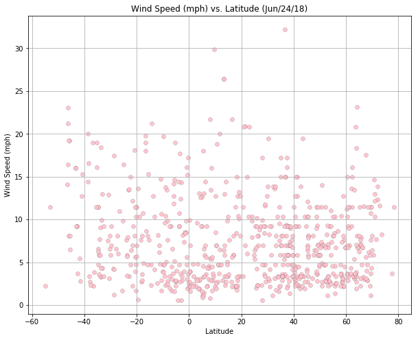

```python
# Dependencies
import json
import matplotlib.pyplot as plt
import requests
import pandas as pd
import numpy as np
import openweathermapy.core as owm
import seaborn as sns
import csv
#https://openweathermap.org/current
```


```python
# Load API Key
from config import api_key
# Import citipy to determine city based on latitude and longitude
from citipy import citipy
# Setting Location Path To Export CSV
file_export = "/Users/carolineteti/Desktop/weather_challenge/city_data.csv"
```


```python
# Set Ranges for Lat and Lng according to Standard
lat_range = (-90,90)
lng_range = (-180,180)
```


```python
# List for Data Storage
lat_lngs = []
cities = []
# Setting Up to Collect Random Pairing of Lat and Lng
# Tie together with Zip
import random 
lats = np.random.uniform(low=-90.000, high=90.000, size=2000)
lngs = np.random.uniform(low=-180.000, high=180.000, size=2000)
lat_lngs = zip(lats,lngs)
# Identifying the Name of Nearest City for each: 
# Lat, Lng Random Combination by Setting up a For Loop
for lat_lng in lat_lngs:
    city = citipy.nearest_city(lat_lng[0],lat_lng[1]).city_name
    # If the city is missing from our cities list, append or add
    if city not in cities:
        cities.append(city)
# Printing City Count for Verification >500
len(cities)
```


    767


```python
# Source URL for Weather MAP API Calls
url = "http://api.openweathermap.org/data/2.5/weather?units=Imperial&"
# Setting up List to Store City Data
city_data = []
# Printing + Fetching
print("City_Data is Fe†ching Key Information, Please Wait")
print("---------------IN BUNDLES OF 100------------------")
# Counter for Next Step
number_count = 1
bundle_count = 1
# Looping through all the cities in list WITH counter and enumerate 
# "It allows us to loop over something and have an automatic counter"
for i, city in enumerate(cities):
    # Pairing city data in groups/bundles of 100 for convenience in further use
    if(i % 100 == 0 and i >= 100):
        bundle_count += 1
        number_count = 0    
    # URL for API call
    city_url = url + "appid=" + api_key + "&q=" + city
    # Printing URL after API call and Chronicalling My Records as "Processing" with
    # Details for Fetching Data
    print("Fetching: No. %s of Bundle %s | %s" % (number_count, bundle_count, city))
    print(city_url)
    # Add 1 to Record_Count
    number_count += 1
    # Run on API request for each of the cities
    try:
        # Store Data into JSON
        city_weather = requests.get(city_url).json()
        # Querying temp_max, humidity, and cloudiness
        city_lat = city_weather["coord"]["lat"]
        city_lng = city_weather["coord"]["lon"]
        city_max_temp = city_weather["main"]["temp_max"]
        city_humidity = city_weather["main"]["humidity"]
        city_clouds = city_weather["clouds"]["all"]
        city_wind = city_weather["wind"]["speed"]
        city_country = city_weather["sys"]["country"]
        city_date = city_weather["dt"]
        # Appending the City information into city_data "list"
        city_data.append({"City": city,
                          "Lat": city_lat,
                          "Lng": city_lng,
                          "Max Temp": city_max_temp,
                          "Humidity": city_humidity,
                          "Cloudiness": city_clouds,
                          "Wind Speed": city_wind,
                          "Country": city_country,
                          "Date": city_date})
    # Prompt to Skip City if There is an Error
    except:
        print("City is not found. Please Ignore.")
        pass
# Showing when Proccess is Completed
print("---------------------------------")
print("City_Data is Successfully Fetched")
print("---------------------------------")
```

    City_Data is Fe†ching Key Information, Please Wait
    ---------------IN BUNDLES OF 100------------------
    Fetching: No. 1 of Bundle 1 | albany
    http://api.openweathermap.org/data/2.5/weather?units=Imperial&appid=25bc90a1196e6f153eece0bc0b0fc9eb&q=albany
    Fetching: No. 2 of Bundle 1 | rikitea
    http://api.openweathermap.org/data/2.5/weather?units=Imperial&appid=25bc90a1196e6f153eece0bc0b0fc9eb&q=rikitea
    Fetching: No. 3 of Bundle 1 | mataura
    http://api.openweathermap.org/data/2.5/weather?units=Imperial&appid=25bc90a1196e6f153eece0bc0b0fc9eb&q=mataura
    Fetching: No. 4 of Bundle 1 | egvekinot
    http://api.openweathermap.org/data/2.5/weather?units=Imperial&appid=25bc90a1196e6f153eece0bc0b0fc9eb&q=egvekinot
    Fetching: No. 5 of Bundle 1 | mayo
    http://api.openweathermap.org/data/2.5/weather?units=Imperial&appid=25bc90a1196e6f153eece0bc0b0fc9eb&q=mayo
    Fetching: No. 6 of Bundle 1 | saskylakh
    http://api.openweathermap.org/data/2.5/weather?units=Imperial&appid=25bc90a1196e6f153eece0bc0b0fc9eb&q=saskylakh
    Fetching: No. 7 of Bundle 1 | qaanaaq
    http://api.openweathermap.org/data/2.5/weather?units=Imperial&appid=25bc90a1196e6f153eece0bc0b0fc9eb&q=qaanaaq
    Fetching: No. 8 of Bundle 1 | zhuhai
    http://api.openweathermap.org/data/2.5/weather?units=Imperial&appid=25bc90a1196e6f153eece0bc0b0fc9eb&q=zhuhai
    Fetching: No. 9 of Bundle 1 | kruisfontein
    http://api.openweathermap.org/data/2.5/weather?units=Imperial&appid=25bc90a1196e6f153eece0bc0b0fc9eb&q=kruisfontein
    Fetching: No. 10 of Bundle 1 | xuanhua
    http://api.openweathermap.org/data/2.5/weather?units=Imperial&appid=25bc90a1196e6f153eece0bc0b0fc9eb&q=xuanhua
    Fetching: No. 11 of Bundle 1 | bengkulu
    http://api.openweathermap.org/data/2.5/weather?units=Imperial&appid=25bc90a1196e6f153eece0bc0b0fc9eb&q=bengkulu
    City is not found. Please Ignore.
    Fetching: No. 12 of Bundle 1 | port alfred
    http://api.openweathermap.org/data/2.5/weather?units=Imperial&appid=25bc90a1196e6f153eece0bc0b0fc9eb&q=port alfred
    Fetching: No. 13 of Bundle 1 | kayerkan
    http://api.openweathermap.org/data/2.5/weather?units=Imperial&appid=25bc90a1196e6f153eece0bc0b0fc9eb&q=kayerkan
    Fetching: No. 14 of Bundle 1 | yellowknife
    http://api.openweathermap.org/data/2.5/weather?units=Imperial&appid=25bc90a1196e6f153eece0bc0b0fc9eb&q=yellowknife
    Fetching: No. 15 of Bundle 1 | pangkalanbuun
    http://api.openweathermap.org/data/2.5/weather?units=Imperial&appid=25bc90a1196e6f153eece0bc0b0fc9eb&q=pangkalanbuun
    Fetching: No. 16 of Bundle 1 | illoqqortoormiut
    http://api.openweathermap.org/data/2.5/weather?units=Imperial&appid=25bc90a1196e6f153eece0bc0b0fc9eb&q=illoqqortoormiut
    City is not found. Please Ignore.
    Fetching: No. 17 of Bundle 1 | tuktoyaktuk
    http://api.openweathermap.org/data/2.5/weather?units=Imperial&appid=25bc90a1196e6f153eece0bc0b0fc9eb&q=tuktoyaktuk
    Fetching: No. 18 of Bundle 1 | viedma
    http://api.openweathermap.org/data/2.5/weather?units=Imperial&appid=25bc90a1196e6f153eece0bc0b0fc9eb&q=viedma
    Fetching: No. 19 of Bundle 1 | miandrivazo
    http://api.openweathermap.org/data/2.5/weather?units=Imperial&appid=25bc90a1196e6f153eece0bc0b0fc9eb&q=miandrivazo
    Fetching: No. 20 of Bundle 1 | ushuaia
    http://api.openweathermap.org/data/2.5/weather?units=Imperial&appid=25bc90a1196e6f153eece0bc0b0fc9eb&q=ushuaia
    Fetching: No. 21 of Bundle 1 | ostrovnoy
    http://api.openweathermap.org/data/2.5/weather?units=Imperial&appid=25bc90a1196e6f153eece0bc0b0fc9eb&q=ostrovnoy
    Fetching: No. 22 of Bundle 1 | miranorte
    http://api.openweathermap.org/data/2.5/weather?units=Imperial&appid=25bc90a1196e6f153eece0bc0b0fc9eb&q=miranorte
    City is not found. Please Ignore.
    Fetching: No. 23 of Bundle 1 | hilo
    http://api.openweathermap.org/data/2.5/weather?units=Imperial&appid=25bc90a1196e6f153eece0bc0b0fc9eb&q=hilo
    Fetching: No. 24 of Bundle 1 | zhigansk
    http://api.openweathermap.org/data/2.5/weather?units=Imperial&appid=25bc90a1196e6f153eece0bc0b0fc9eb&q=zhigansk
    Fetching: No. 25 of Bundle 1 | vaini
    http://api.openweathermap.org/data/2.5/weather?units=Imperial&appid=25bc90a1196e6f153eece0bc0b0fc9eb&q=vaini
    Fetching: No. 26 of Bundle 1 | suleja
    http://api.openweathermap.org/data/2.5/weather?units=Imperial&appid=25bc90a1196e6f153eece0bc0b0fc9eb&q=suleja
    Fetching: No. 27 of Bundle 1 | thompson
    http://api.openweathermap.org/data/2.5/weather?units=Imperial&appid=25bc90a1196e6f153eece0bc0b0fc9eb&q=thompson
    Fetching: No. 28 of Bundle 1 | marsala
    http://api.openweathermap.org/data/2.5/weather?units=Imperial&appid=25bc90a1196e6f153eece0bc0b0fc9eb&q=marsala
    Fetching: No. 29 of Bundle 1 | khatanga
    http://api.openweathermap.org/data/2.5/weather?units=Imperial&appid=25bc90a1196e6f153eece0bc0b0fc9eb&q=khatanga
    Fetching: No. 30 of Bundle 1 | belushya guba
    http://api.openweathermap.org/data/2.5/weather?units=Imperial&appid=25bc90a1196e6f153eece0bc0b0fc9eb&q=belushya guba
    City is not found. Please Ignore.
    Fetching: No. 31 of Bundle 1 | new norfolk
    http://api.openweathermap.org/data/2.5/weather?units=Imperial&appid=25bc90a1196e6f153eece0bc0b0fc9eb&q=new norfolk
    Fetching: No. 32 of Bundle 1 | hohhot
    http://api.openweathermap.org/data/2.5/weather?units=Imperial&appid=25bc90a1196e6f153eece0bc0b0fc9eb&q=hohhot
    Fetching: No. 33 of Bundle 1 | arraial do cabo
    http://api.openweathermap.org/data/2.5/weather?units=Imperial&appid=25bc90a1196e6f153eece0bc0b0fc9eb&q=arraial do cabo
    Fetching: No. 34 of Bundle 1 | cape town
    http://api.openweathermap.org/data/2.5/weather?units=Imperial&appid=25bc90a1196e6f153eece0bc0b0fc9eb&q=cape town
    Fetching: No. 35 of Bundle 1 | tsihombe
    http://api.openweathermap.org/data/2.5/weather?units=Imperial&appid=25bc90a1196e6f153eece0bc0b0fc9eb&q=tsihombe
    City is not found. Please Ignore.
    Fetching: No. 36 of Bundle 1 | bethel
    http://api.openweathermap.org/data/2.5/weather?units=Imperial&appid=25bc90a1196e6f153eece0bc0b0fc9eb&q=bethel
    Fetching: No. 37 of Bundle 1 | aklavik
    http://api.openweathermap.org/data/2.5/weather?units=Imperial&appid=25bc90a1196e6f153eece0bc0b0fc9eb&q=aklavik
    Fetching: No. 38 of Bundle 1 | nieves
    http://api.openweathermap.org/data/2.5/weather?units=Imperial&appid=25bc90a1196e6f153eece0bc0b0fc9eb&q=nieves
    Fetching: No. 39 of Bundle 1 | abha
    http://api.openweathermap.org/data/2.5/weather?units=Imperial&appid=25bc90a1196e6f153eece0bc0b0fc9eb&q=abha
    Fetching: No. 40 of Bundle 1 | punta arenas
    http://api.openweathermap.org/data/2.5/weather?units=Imperial&appid=25bc90a1196e6f153eece0bc0b0fc9eb&q=punta arenas
    Fetching: No. 41 of Bundle 1 | bredasdorp
    http://api.openweathermap.org/data/2.5/weather?units=Imperial&appid=25bc90a1196e6f153eece0bc0b0fc9eb&q=bredasdorp
    Fetching: No. 42 of Bundle 1 | sitka
    http://api.openweathermap.org/data/2.5/weather?units=Imperial&appid=25bc90a1196e6f153eece0bc0b0fc9eb&q=sitka
    Fetching: No. 43 of Bundle 1 | kavaratti
    http://api.openweathermap.org/data/2.5/weather?units=Imperial&appid=25bc90a1196e6f153eece0bc0b0fc9eb&q=kavaratti
    Fetching: No. 44 of Bundle 1 | walvis bay
    http://api.openweathermap.org/data/2.5/weather?units=Imperial&appid=25bc90a1196e6f153eece0bc0b0fc9eb&q=walvis bay
    Fetching: No. 45 of Bundle 1 | marion
    http://api.openweathermap.org/data/2.5/weather?units=Imperial&appid=25bc90a1196e6f153eece0bc0b0fc9eb&q=marion
    Fetching: No. 46 of Bundle 1 | vuktyl
    http://api.openweathermap.org/data/2.5/weather?units=Imperial&appid=25bc90a1196e6f153eece0bc0b0fc9eb&q=vuktyl
    Fetching: No. 47 of Bundle 1 | ribeira grande
    http://api.openweathermap.org/data/2.5/weather?units=Imperial&appid=25bc90a1196e6f153eece0bc0b0fc9eb&q=ribeira grande
    Fetching: No. 48 of Bundle 1 | castro
    http://api.openweathermap.org/data/2.5/weather?units=Imperial&appid=25bc90a1196e6f153eece0bc0b0fc9eb&q=castro
    Fetching: No. 49 of Bundle 1 | jamestown
    http://api.openweathermap.org/data/2.5/weather?units=Imperial&appid=25bc90a1196e6f153eece0bc0b0fc9eb&q=jamestown
    Fetching: No. 50 of Bundle 1 | yar-sale
    http://api.openweathermap.org/data/2.5/weather?units=Imperial&appid=25bc90a1196e6f153eece0bc0b0fc9eb&q=yar-sale
    Fetching: No. 51 of Bundle 1 | cazones
    http://api.openweathermap.org/data/2.5/weather?units=Imperial&appid=25bc90a1196e6f153eece0bc0b0fc9eb&q=cazones
    Fetching: No. 52 of Bundle 1 | dikson
    http://api.openweathermap.org/data/2.5/weather?units=Imperial&appid=25bc90a1196e6f153eece0bc0b0fc9eb&q=dikson
    Fetching: No. 53 of Bundle 1 | bilma
    http://api.openweathermap.org/data/2.5/weather?units=Imperial&appid=25bc90a1196e6f153eece0bc0b0fc9eb&q=bilma
    Fetching: No. 54 of Bundle 1 | rabo de peixe
    http://api.openweathermap.org/data/2.5/weather?units=Imperial&appid=25bc90a1196e6f153eece0bc0b0fc9eb&q=rabo de peixe
    Fetching: No. 55 of Bundle 1 | sao joao da barra
    http://api.openweathermap.org/data/2.5/weather?units=Imperial&appid=25bc90a1196e6f153eece0bc0b0fc9eb&q=sao joao da barra
    Fetching: No. 56 of Bundle 1 | ancud
    http://api.openweathermap.org/data/2.5/weather?units=Imperial&appid=25bc90a1196e6f153eece0bc0b0fc9eb&q=ancud
    Fetching: No. 57 of Bundle 1 | butaritari
    http://api.openweathermap.org/data/2.5/weather?units=Imperial&appid=25bc90a1196e6f153eece0bc0b0fc9eb&q=butaritari
    Fetching: No. 58 of Bundle 1 | avarua
    http://api.openweathermap.org/data/2.5/weather?units=Imperial&appid=25bc90a1196e6f153eece0bc0b0fc9eb&q=avarua
    Fetching: No. 59 of Bundle 1 | busselton
    http://api.openweathermap.org/data/2.5/weather?units=Imperial&appid=25bc90a1196e6f153eece0bc0b0fc9eb&q=busselton
    Fetching: No. 60 of Bundle 1 | coahuayana
    http://api.openweathermap.org/data/2.5/weather?units=Imperial&appid=25bc90a1196e6f153eece0bc0b0fc9eb&q=coahuayana
    Fetching: No. 61 of Bundle 1 | port blair
    http://api.openweathermap.org/data/2.5/weather?units=Imperial&appid=25bc90a1196e6f153eece0bc0b0fc9eb&q=port blair
    Fetching: No. 62 of Bundle 1 | alexandria
    http://api.openweathermap.org/data/2.5/weather?units=Imperial&appid=25bc90a1196e6f153eece0bc0b0fc9eb&q=alexandria
    Fetching: No. 63 of Bundle 1 | hakui
    http://api.openweathermap.org/data/2.5/weather?units=Imperial&appid=25bc90a1196e6f153eece0bc0b0fc9eb&q=hakui
    Fetching: No. 64 of Bundle 1 | barentsburg
    http://api.openweathermap.org/data/2.5/weather?units=Imperial&appid=25bc90a1196e6f153eece0bc0b0fc9eb&q=barentsburg
    City is not found. Please Ignore.
    Fetching: No. 65 of Bundle 1 | khash
    http://api.openweathermap.org/data/2.5/weather?units=Imperial&appid=25bc90a1196e6f153eece0bc0b0fc9eb&q=khash
    Fetching: No. 66 of Bundle 1 | katherine
    http://api.openweathermap.org/data/2.5/weather?units=Imperial&appid=25bc90a1196e6f153eece0bc0b0fc9eb&q=katherine
    Fetching: No. 67 of Bundle 1 | mahajanga
    http://api.openweathermap.org/data/2.5/weather?units=Imperial&appid=25bc90a1196e6f153eece0bc0b0fc9eb&q=mahajanga
    Fetching: No. 68 of Bundle 1 | maceio
    http://api.openweathermap.org/data/2.5/weather?units=Imperial&appid=25bc90a1196e6f153eece0bc0b0fc9eb&q=maceio
    Fetching: No. 69 of Bundle 1 | soubre
    http://api.openweathermap.org/data/2.5/weather?units=Imperial&appid=25bc90a1196e6f153eece0bc0b0fc9eb&q=soubre
    Fetching: No. 70 of Bundle 1 | bambous virieux
    http://api.openweathermap.org/data/2.5/weather?units=Imperial&appid=25bc90a1196e6f153eece0bc0b0fc9eb&q=bambous virieux
    Fetching: No. 71 of Bundle 1 | wewak
    http://api.openweathermap.org/data/2.5/weather?units=Imperial&appid=25bc90a1196e6f153eece0bc0b0fc9eb&q=wewak
    Fetching: No. 72 of Bundle 1 | pierre
    http://api.openweathermap.org/data/2.5/weather?units=Imperial&appid=25bc90a1196e6f153eece0bc0b0fc9eb&q=pierre
    Fetching: No. 73 of Bundle 1 | alice springs
    http://api.openweathermap.org/data/2.5/weather?units=Imperial&appid=25bc90a1196e6f153eece0bc0b0fc9eb&q=alice springs
    Fetching: No. 74 of Bundle 1 | sao jose da coroa grande
    http://api.openweathermap.org/data/2.5/weather?units=Imperial&appid=25bc90a1196e6f153eece0bc0b0fc9eb&q=sao jose da coroa grande
    Fetching: No. 75 of Bundle 1 | cap malheureux
    http://api.openweathermap.org/data/2.5/weather?units=Imperial&appid=25bc90a1196e6f153eece0bc0b0fc9eb&q=cap malheureux
    Fetching: No. 76 of Bundle 1 | taolanaro
    http://api.openweathermap.org/data/2.5/weather?units=Imperial&appid=25bc90a1196e6f153eece0bc0b0fc9eb&q=taolanaro
    City is not found. Please Ignore.
    Fetching: No. 77 of Bundle 1 | puerto ayora
    http://api.openweathermap.org/data/2.5/weather?units=Imperial&appid=25bc90a1196e6f153eece0bc0b0fc9eb&q=puerto ayora
    Fetching: No. 78 of Bundle 1 | cidreira
    http://api.openweathermap.org/data/2.5/weather?units=Imperial&appid=25bc90a1196e6f153eece0bc0b0fc9eb&q=cidreira
    Fetching: No. 79 of Bundle 1 | praia da vitoria
    http://api.openweathermap.org/data/2.5/weather?units=Imperial&appid=25bc90a1196e6f153eece0bc0b0fc9eb&q=praia da vitoria
    Fetching: No. 80 of Bundle 1 | bonthe
    http://api.openweathermap.org/data/2.5/weather?units=Imperial&appid=25bc90a1196e6f153eece0bc0b0fc9eb&q=bonthe
    Fetching: No. 81 of Bundle 1 | axim
    http://api.openweathermap.org/data/2.5/weather?units=Imperial&appid=25bc90a1196e6f153eece0bc0b0fc9eb&q=axim
    Fetching: No. 82 of Bundle 1 | hobart
    http://api.openweathermap.org/data/2.5/weather?units=Imperial&appid=25bc90a1196e6f153eece0bc0b0fc9eb&q=hobart
    Fetching: No. 83 of Bundle 1 | canutama
    http://api.openweathermap.org/data/2.5/weather?units=Imperial&appid=25bc90a1196e6f153eece0bc0b0fc9eb&q=canutama
    Fetching: No. 84 of Bundle 1 | georgetown
    http://api.openweathermap.org/data/2.5/weather?units=Imperial&appid=25bc90a1196e6f153eece0bc0b0fc9eb&q=georgetown
    Fetching: No. 85 of Bundle 1 | airai
    http://api.openweathermap.org/data/2.5/weather?units=Imperial&appid=25bc90a1196e6f153eece0bc0b0fc9eb&q=airai
    Fetching: No. 86 of Bundle 1 | sabancuy
    http://api.openweathermap.org/data/2.5/weather?units=Imperial&appid=25bc90a1196e6f153eece0bc0b0fc9eb&q=sabancuy
    Fetching: No. 87 of Bundle 1 | najran
    http://api.openweathermap.org/data/2.5/weather?units=Imperial&appid=25bc90a1196e6f153eece0bc0b0fc9eb&q=najran
    Fetching: No. 88 of Bundle 1 | kapaa
    http://api.openweathermap.org/data/2.5/weather?units=Imperial&appid=25bc90a1196e6f153eece0bc0b0fc9eb&q=kapaa
    Fetching: No. 89 of Bundle 1 | moose factory
    http://api.openweathermap.org/data/2.5/weather?units=Imperial&appid=25bc90a1196e6f153eece0bc0b0fc9eb&q=moose factory
    Fetching: No. 90 of Bundle 1 | ponta delgada
    http://api.openweathermap.org/data/2.5/weather?units=Imperial&appid=25bc90a1196e6f153eece0bc0b0fc9eb&q=ponta delgada
    Fetching: No. 91 of Bundle 1 | petropavlovsk-kamchatskiy
    http://api.openweathermap.org/data/2.5/weather?units=Imperial&appid=25bc90a1196e6f153eece0bc0b0fc9eb&q=petropavlovsk-kamchatskiy
    Fetching: No. 92 of Bundle 1 | bubaque
    http://api.openweathermap.org/data/2.5/weather?units=Imperial&appid=25bc90a1196e6f153eece0bc0b0fc9eb&q=bubaque
    Fetching: No. 93 of Bundle 1 | hermanus
    http://api.openweathermap.org/data/2.5/weather?units=Imperial&appid=25bc90a1196e6f153eece0bc0b0fc9eb&q=hermanus
    Fetching: No. 94 of Bundle 1 | thanh hoa
    http://api.openweathermap.org/data/2.5/weather?units=Imperial&appid=25bc90a1196e6f153eece0bc0b0fc9eb&q=thanh hoa
    Fetching: No. 95 of Bundle 1 | hobyo
    http://api.openweathermap.org/data/2.5/weather?units=Imperial&appid=25bc90a1196e6f153eece0bc0b0fc9eb&q=hobyo
    Fetching: No. 96 of Bundle 1 | toliary
    http://api.openweathermap.org/data/2.5/weather?units=Imperial&appid=25bc90a1196e6f153eece0bc0b0fc9eb&q=toliary
    City is not found. Please Ignore.
    Fetching: No. 97 of Bundle 1 | amderma
    http://api.openweathermap.org/data/2.5/weather?units=Imperial&appid=25bc90a1196e6f153eece0bc0b0fc9eb&q=amderma
    City is not found. Please Ignore.
    Fetching: No. 98 of Bundle 1 | patzcuaro
    http://api.openweathermap.org/data/2.5/weather?units=Imperial&appid=25bc90a1196e6f153eece0bc0b0fc9eb&q=patzcuaro
    Fetching: No. 99 of Bundle 1 | los llanos de aridane
    http://api.openweathermap.org/data/2.5/weather?units=Imperial&appid=25bc90a1196e6f153eece0bc0b0fc9eb&q=los llanos de aridane
    Fetching: No. 100 of Bundle 1 | iroquois falls
    http://api.openweathermap.org/data/2.5/weather?units=Imperial&appid=25bc90a1196e6f153eece0bc0b0fc9eb&q=iroquois falls
    Fetching: No. 0 of Bundle 2 | hofn
    http://api.openweathermap.org/data/2.5/weather?units=Imperial&appid=25bc90a1196e6f153eece0bc0b0fc9eb&q=hofn
    Fetching: No. 1 of Bundle 2 | det udom
    http://api.openweathermap.org/data/2.5/weather?units=Imperial&appid=25bc90a1196e6f153eece0bc0b0fc9eb&q=det udom
    Fetching: No. 2 of Bundle 2 | chernyshevskiy
    http://api.openweathermap.org/data/2.5/weather?units=Imperial&appid=25bc90a1196e6f153eece0bc0b0fc9eb&q=chernyshevskiy
    Fetching: No. 3 of Bundle 2 | port augusta
    http://api.openweathermap.org/data/2.5/weather?units=Imperial&appid=25bc90a1196e6f153eece0bc0b0fc9eb&q=port augusta
    Fetching: No. 4 of Bundle 2 | llangefni
    http://api.openweathermap.org/data/2.5/weather?units=Imperial&appid=25bc90a1196e6f153eece0bc0b0fc9eb&q=llangefni
    Fetching: No. 5 of Bundle 2 | mys shmidta
    http://api.openweathermap.org/data/2.5/weather?units=Imperial&appid=25bc90a1196e6f153eece0bc0b0fc9eb&q=mys shmidta
    City is not found. Please Ignore.
    Fetching: No. 6 of Bundle 2 | grindavik
    http://api.openweathermap.org/data/2.5/weather?units=Imperial&appid=25bc90a1196e6f153eece0bc0b0fc9eb&q=grindavik
    Fetching: No. 7 of Bundle 2 | saldanha
    http://api.openweathermap.org/data/2.5/weather?units=Imperial&appid=25bc90a1196e6f153eece0bc0b0fc9eb&q=saldanha
    Fetching: No. 8 of Bundle 2 | bargal
    http://api.openweathermap.org/data/2.5/weather?units=Imperial&appid=25bc90a1196e6f153eece0bc0b0fc9eb&q=bargal
    City is not found. Please Ignore.
    Fetching: No. 9 of Bundle 2 | speightstown
    http://api.openweathermap.org/data/2.5/weather?units=Imperial&appid=25bc90a1196e6f153eece0bc0b0fc9eb&q=speightstown
    Fetching: No. 10 of Bundle 2 | olafsvik
    http://api.openweathermap.org/data/2.5/weather?units=Imperial&appid=25bc90a1196e6f153eece0bc0b0fc9eb&q=olafsvik
    City is not found. Please Ignore.
    Fetching: No. 11 of Bundle 2 | dingle
    http://api.openweathermap.org/data/2.5/weather?units=Imperial&appid=25bc90a1196e6f153eece0bc0b0fc9eb&q=dingle
    Fetching: No. 12 of Bundle 2 | katsuura
    http://api.openweathermap.org/data/2.5/weather?units=Imperial&appid=25bc90a1196e6f153eece0bc0b0fc9eb&q=katsuura
    Fetching: No. 13 of Bundle 2 | esperance
    http://api.openweathermap.org/data/2.5/weather?units=Imperial&appid=25bc90a1196e6f153eece0bc0b0fc9eb&q=esperance
    Fetching: No. 14 of Bundle 2 | felidhoo
    http://api.openweathermap.org/data/2.5/weather?units=Imperial&appid=25bc90a1196e6f153eece0bc0b0fc9eb&q=felidhoo
    City is not found. Please Ignore.
    Fetching: No. 15 of Bundle 2 | constitucion
    http://api.openweathermap.org/data/2.5/weather?units=Imperial&appid=25bc90a1196e6f153eece0bc0b0fc9eb&q=constitucion
    Fetching: No. 16 of Bundle 2 | laguna
    http://api.openweathermap.org/data/2.5/weather?units=Imperial&appid=25bc90a1196e6f153eece0bc0b0fc9eb&q=laguna
    Fetching: No. 17 of Bundle 2 | carnarvon
    http://api.openweathermap.org/data/2.5/weather?units=Imperial&appid=25bc90a1196e6f153eece0bc0b0fc9eb&q=carnarvon
    Fetching: No. 18 of Bundle 2 | atuona
    http://api.openweathermap.org/data/2.5/weather?units=Imperial&appid=25bc90a1196e6f153eece0bc0b0fc9eb&q=atuona
    Fetching: No. 19 of Bundle 2 | east london
    http://api.openweathermap.org/data/2.5/weather?units=Imperial&appid=25bc90a1196e6f153eece0bc0b0fc9eb&q=east london
    Fetching: No. 20 of Bundle 2 | san cristobal
    http://api.openweathermap.org/data/2.5/weather?units=Imperial&appid=25bc90a1196e6f153eece0bc0b0fc9eb&q=san cristobal
    Fetching: No. 21 of Bundle 2 | bluff
    http://api.openweathermap.org/data/2.5/weather?units=Imperial&appid=25bc90a1196e6f153eece0bc0b0fc9eb&q=bluff
    Fetching: No. 22 of Bundle 2 | hithadhoo
    http://api.openweathermap.org/data/2.5/weather?units=Imperial&appid=25bc90a1196e6f153eece0bc0b0fc9eb&q=hithadhoo
    Fetching: No. 23 of Bundle 2 | arlit
    http://api.openweathermap.org/data/2.5/weather?units=Imperial&appid=25bc90a1196e6f153eece0bc0b0fc9eb&q=arlit
    Fetching: No. 24 of Bundle 2 | nikolskoye
    http://api.openweathermap.org/data/2.5/weather?units=Imperial&appid=25bc90a1196e6f153eece0bc0b0fc9eb&q=nikolskoye
    Fetching: No. 25 of Bundle 2 | dipkarpaz
    http://api.openweathermap.org/data/2.5/weather?units=Imperial&appid=25bc90a1196e6f153eece0bc0b0fc9eb&q=dipkarpaz
    City is not found. Please Ignore.
    Fetching: No. 26 of Bundle 2 | waitati
    http://api.openweathermap.org/data/2.5/weather?units=Imperial&appid=25bc90a1196e6f153eece0bc0b0fc9eb&q=waitati
    Fetching: No. 27 of Bundle 2 | novyy svit
    http://api.openweathermap.org/data/2.5/weather?units=Imperial&appid=25bc90a1196e6f153eece0bc0b0fc9eb&q=novyy svit
    Fetching: No. 28 of Bundle 2 | libreville
    http://api.openweathermap.org/data/2.5/weather?units=Imperial&appid=25bc90a1196e6f153eece0bc0b0fc9eb&q=libreville
    Fetching: No. 29 of Bundle 2 | longyearbyen
    http://api.openweathermap.org/data/2.5/weather?units=Imperial&appid=25bc90a1196e6f153eece0bc0b0fc9eb&q=longyearbyen
    Fetching: No. 30 of Bundle 2 | sao gabriel da cachoeira
    http://api.openweathermap.org/data/2.5/weather?units=Imperial&appid=25bc90a1196e6f153eece0bc0b0fc9eb&q=sao gabriel da cachoeira
    Fetching: No. 31 of Bundle 2 | lake city
    http://api.openweathermap.org/data/2.5/weather?units=Imperial&appid=25bc90a1196e6f153eece0bc0b0fc9eb&q=lake city
    Fetching: No. 32 of Bundle 2 | hambantota
    http://api.openweathermap.org/data/2.5/weather?units=Imperial&appid=25bc90a1196e6f153eece0bc0b0fc9eb&q=hambantota
    Fetching: No. 33 of Bundle 2 | mackay
    http://api.openweathermap.org/data/2.5/weather?units=Imperial&appid=25bc90a1196e6f153eece0bc0b0fc9eb&q=mackay
    Fetching: No. 34 of Bundle 2 | plettenberg bay
    http://api.openweathermap.org/data/2.5/weather?units=Imperial&appid=25bc90a1196e6f153eece0bc0b0fc9eb&q=plettenberg bay
    Fetching: No. 35 of Bundle 2 | barguzin
    http://api.openweathermap.org/data/2.5/weather?units=Imperial&appid=25bc90a1196e6f153eece0bc0b0fc9eb&q=barguzin
    Fetching: No. 36 of Bundle 2 | tilichiki
    http://api.openweathermap.org/data/2.5/weather?units=Imperial&appid=25bc90a1196e6f153eece0bc0b0fc9eb&q=tilichiki
    Fetching: No. 37 of Bundle 2 | lagoa
    http://api.openweathermap.org/data/2.5/weather?units=Imperial&appid=25bc90a1196e6f153eece0bc0b0fc9eb&q=lagoa
    Fetching: No. 38 of Bundle 2 | torbay
    http://api.openweathermap.org/data/2.5/weather?units=Imperial&appid=25bc90a1196e6f153eece0bc0b0fc9eb&q=torbay
    Fetching: No. 39 of Bundle 2 | kytlym
    http://api.openweathermap.org/data/2.5/weather?units=Imperial&appid=25bc90a1196e6f153eece0bc0b0fc9eb&q=kytlym
    City is not found. Please Ignore.
    Fetching: No. 40 of Bundle 2 | souillac
    http://api.openweathermap.org/data/2.5/weather?units=Imperial&appid=25bc90a1196e6f153eece0bc0b0fc9eb&q=souillac
    Fetching: No. 41 of Bundle 2 | otradnoye
    http://api.openweathermap.org/data/2.5/weather?units=Imperial&appid=25bc90a1196e6f153eece0bc0b0fc9eb&q=otradnoye
    Fetching: No. 42 of Bundle 2 | batagay-alyta
    http://api.openweathermap.org/data/2.5/weather?units=Imperial&appid=25bc90a1196e6f153eece0bc0b0fc9eb&q=batagay-alyta
    Fetching: No. 43 of Bundle 2 | garowe
    http://api.openweathermap.org/data/2.5/weather?units=Imperial&appid=25bc90a1196e6f153eece0bc0b0fc9eb&q=garowe
    Fetching: No. 44 of Bundle 2 | barrow
    http://api.openweathermap.org/data/2.5/weather?units=Imperial&appid=25bc90a1196e6f153eece0bc0b0fc9eb&q=barrow
    Fetching: No. 45 of Bundle 2 | portland
    http://api.openweathermap.org/data/2.5/weather?units=Imperial&appid=25bc90a1196e6f153eece0bc0b0fc9eb&q=portland
    Fetching: No. 46 of Bundle 2 | ostersund
    http://api.openweathermap.org/data/2.5/weather?units=Imperial&appid=25bc90a1196e6f153eece0bc0b0fc9eb&q=ostersund
    Fetching: No. 47 of Bundle 2 | sorland
    http://api.openweathermap.org/data/2.5/weather?units=Imperial&appid=25bc90a1196e6f153eece0bc0b0fc9eb&q=sorland
    Fetching: No. 48 of Bundle 2 | linhai
    http://api.openweathermap.org/data/2.5/weather?units=Imperial&appid=25bc90a1196e6f153eece0bc0b0fc9eb&q=linhai
    Fetching: No. 49 of Bundle 2 | vallenar
    http://api.openweathermap.org/data/2.5/weather?units=Imperial&appid=25bc90a1196e6f153eece0bc0b0fc9eb&q=vallenar
    Fetching: No. 50 of Bundle 2 | bara
    http://api.openweathermap.org/data/2.5/weather?units=Imperial&appid=25bc90a1196e6f153eece0bc0b0fc9eb&q=bara
    Fetching: No. 51 of Bundle 2 | yining
    http://api.openweathermap.org/data/2.5/weather?units=Imperial&appid=25bc90a1196e6f153eece0bc0b0fc9eb&q=yining
    Fetching: No. 52 of Bundle 2 | kismayo
    http://api.openweathermap.org/data/2.5/weather?units=Imperial&appid=25bc90a1196e6f153eece0bc0b0fc9eb&q=kismayo
    City is not found. Please Ignore.
    Fetching: No. 53 of Bundle 2 | brae
    http://api.openweathermap.org/data/2.5/weather?units=Imperial&appid=25bc90a1196e6f153eece0bc0b0fc9eb&q=brae
    Fetching: No. 54 of Bundle 2 | clyde river
    http://api.openweathermap.org/data/2.5/weather?units=Imperial&appid=25bc90a1196e6f153eece0bc0b0fc9eb&q=clyde river
    Fetching: No. 55 of Bundle 2 | tiksi
    http://api.openweathermap.org/data/2.5/weather?units=Imperial&appid=25bc90a1196e6f153eece0bc0b0fc9eb&q=tiksi
    Fetching: No. 56 of Bundle 2 | vaitupu
    http://api.openweathermap.org/data/2.5/weather?units=Imperial&appid=25bc90a1196e6f153eece0bc0b0fc9eb&q=vaitupu
    City is not found. Please Ignore.
    Fetching: No. 57 of Bundle 2 | sembakung
    http://api.openweathermap.org/data/2.5/weather?units=Imperial&appid=25bc90a1196e6f153eece0bc0b0fc9eb&q=sembakung
    Fetching: No. 58 of Bundle 2 | cockburn town
    http://api.openweathermap.org/data/2.5/weather?units=Imperial&appid=25bc90a1196e6f153eece0bc0b0fc9eb&q=cockburn town
    Fetching: No. 59 of Bundle 2 | beyneu
    http://api.openweathermap.org/data/2.5/weather?units=Imperial&appid=25bc90a1196e6f153eece0bc0b0fc9eb&q=beyneu
    Fetching: No. 60 of Bundle 2 | daru
    http://api.openweathermap.org/data/2.5/weather?units=Imperial&appid=25bc90a1196e6f153eece0bc0b0fc9eb&q=daru
    Fetching: No. 61 of Bundle 2 | krasnoarmeysk
    http://api.openweathermap.org/data/2.5/weather?units=Imperial&appid=25bc90a1196e6f153eece0bc0b0fc9eb&q=krasnoarmeysk
    Fetching: No. 62 of Bundle 2 | ponta do sol
    http://api.openweathermap.org/data/2.5/weather?units=Imperial&appid=25bc90a1196e6f153eece0bc0b0fc9eb&q=ponta do sol
    Fetching: No. 63 of Bundle 2 | novobelokatay
    http://api.openweathermap.org/data/2.5/weather?units=Imperial&appid=25bc90a1196e6f153eece0bc0b0fc9eb&q=novobelokatay
    Fetching: No. 64 of Bundle 2 | comodoro rivadavia
    http://api.openweathermap.org/data/2.5/weather?units=Imperial&appid=25bc90a1196e6f153eece0bc0b0fc9eb&q=comodoro rivadavia
    Fetching: No. 65 of Bundle 2 | conceicao do araguaia
    http://api.openweathermap.org/data/2.5/weather?units=Imperial&appid=25bc90a1196e6f153eece0bc0b0fc9eb&q=conceicao do araguaia
    Fetching: No. 66 of Bundle 2 | norman wells
    http://api.openweathermap.org/data/2.5/weather?units=Imperial&appid=25bc90a1196e6f153eece0bc0b0fc9eb&q=norman wells
    Fetching: No. 67 of Bundle 2 | san patricio
    http://api.openweathermap.org/data/2.5/weather?units=Imperial&appid=25bc90a1196e6f153eece0bc0b0fc9eb&q=san patricio
    Fetching: No. 68 of Bundle 2 | we
    http://api.openweathermap.org/data/2.5/weather?units=Imperial&appid=25bc90a1196e6f153eece0bc0b0fc9eb&q=we
    City is not found. Please Ignore.
    Fetching: No. 69 of Bundle 2 | vic
    http://api.openweathermap.org/data/2.5/weather?units=Imperial&appid=25bc90a1196e6f153eece0bc0b0fc9eb&q=vic
    Fetching: No. 70 of Bundle 2 | vila franca do campo
    http://api.openweathermap.org/data/2.5/weather?units=Imperial&appid=25bc90a1196e6f153eece0bc0b0fc9eb&q=vila franca do campo
    Fetching: No. 71 of Bundle 2 | tasiilaq
    http://api.openweathermap.org/data/2.5/weather?units=Imperial&appid=25bc90a1196e6f153eece0bc0b0fc9eb&q=tasiilaq
    Fetching: No. 72 of Bundle 2 | luderitz
    http://api.openweathermap.org/data/2.5/weather?units=Imperial&appid=25bc90a1196e6f153eece0bc0b0fc9eb&q=luderitz
    Fetching: No. 73 of Bundle 2 | avera
    http://api.openweathermap.org/data/2.5/weather?units=Imperial&appid=25bc90a1196e6f153eece0bc0b0fc9eb&q=avera
    Fetching: No. 74 of Bundle 2 | svetlogorsk
    http://api.openweathermap.org/data/2.5/weather?units=Imperial&appid=25bc90a1196e6f153eece0bc0b0fc9eb&q=svetlogorsk
    Fetching: No. 75 of Bundle 2 | santa maria
    http://api.openweathermap.org/data/2.5/weather?units=Imperial&appid=25bc90a1196e6f153eece0bc0b0fc9eb&q=santa maria
    Fetching: No. 76 of Bundle 2 | opuwo
    http://api.openweathermap.org/data/2.5/weather?units=Imperial&appid=25bc90a1196e6f153eece0bc0b0fc9eb&q=opuwo
    Fetching: No. 77 of Bundle 2 | fier
    http://api.openweathermap.org/data/2.5/weather?units=Imperial&appid=25bc90a1196e6f153eece0bc0b0fc9eb&q=fier
    Fetching: No. 78 of Bundle 2 | cherskiy
    http://api.openweathermap.org/data/2.5/weather?units=Imperial&appid=25bc90a1196e6f153eece0bc0b0fc9eb&q=cherskiy
    Fetching: No. 79 of Bundle 2 | nanortalik
    http://api.openweathermap.org/data/2.5/weather?units=Imperial&appid=25bc90a1196e6f153eece0bc0b0fc9eb&q=nanortalik
    Fetching: No. 80 of Bundle 2 | chulym
    http://api.openweathermap.org/data/2.5/weather?units=Imperial&appid=25bc90a1196e6f153eece0bc0b0fc9eb&q=chulym
    Fetching: No. 81 of Bundle 2 | bull savanna
    http://api.openweathermap.org/data/2.5/weather?units=Imperial&appid=25bc90a1196e6f153eece0bc0b0fc9eb&q=bull savanna
    Fetching: No. 82 of Bundle 2 | kodiak
    http://api.openweathermap.org/data/2.5/weather?units=Imperial&appid=25bc90a1196e6f153eece0bc0b0fc9eb&q=kodiak
    Fetching: No. 83 of Bundle 2 | tual
    http://api.openweathermap.org/data/2.5/weather?units=Imperial&appid=25bc90a1196e6f153eece0bc0b0fc9eb&q=tual
    Fetching: No. 84 of Bundle 2 | flinders
    http://api.openweathermap.org/data/2.5/weather?units=Imperial&appid=25bc90a1196e6f153eece0bc0b0fc9eb&q=flinders
    Fetching: No. 85 of Bundle 2 | umea
    http://api.openweathermap.org/data/2.5/weather?units=Imperial&appid=25bc90a1196e6f153eece0bc0b0fc9eb&q=umea
    Fetching: No. 86 of Bundle 2 | meulaboh
    http://api.openweathermap.org/data/2.5/weather?units=Imperial&appid=25bc90a1196e6f153eece0bc0b0fc9eb&q=meulaboh
    Fetching: No. 87 of Bundle 2 | mayor pablo lagerenza
    http://api.openweathermap.org/data/2.5/weather?units=Imperial&appid=25bc90a1196e6f153eece0bc0b0fc9eb&q=mayor pablo lagerenza
    Fetching: No. 88 of Bundle 2 | pevek
    http://api.openweathermap.org/data/2.5/weather?units=Imperial&appid=25bc90a1196e6f153eece0bc0b0fc9eb&q=pevek
    Fetching: No. 89 of Bundle 2 | mount gambier
    http://api.openweathermap.org/data/2.5/weather?units=Imperial&appid=25bc90a1196e6f153eece0bc0b0fc9eb&q=mount gambier
    Fetching: No. 90 of Bundle 2 | hearst
    http://api.openweathermap.org/data/2.5/weather?units=Imperial&appid=25bc90a1196e6f153eece0bc0b0fc9eb&q=hearst
    Fetching: No. 91 of Bundle 2 | kaeo
    http://api.openweathermap.org/data/2.5/weather?units=Imperial&appid=25bc90a1196e6f153eece0bc0b0fc9eb&q=kaeo
    Fetching: No. 92 of Bundle 2 | gushikawa
    http://api.openweathermap.org/data/2.5/weather?units=Imperial&appid=25bc90a1196e6f153eece0bc0b0fc9eb&q=gushikawa
    Fetching: No. 93 of Bundle 2 | wahran
    http://api.openweathermap.org/data/2.5/weather?units=Imperial&appid=25bc90a1196e6f153eece0bc0b0fc9eb&q=wahran
    City is not found. Please Ignore.
    Fetching: No. 94 of Bundle 2 | kiama
    http://api.openweathermap.org/data/2.5/weather?units=Imperial&appid=25bc90a1196e6f153eece0bc0b0fc9eb&q=kiama
    Fetching: No. 95 of Bundle 2 | kalmunai
    http://api.openweathermap.org/data/2.5/weather?units=Imperial&appid=25bc90a1196e6f153eece0bc0b0fc9eb&q=kalmunai
    Fetching: No. 96 of Bundle 2 | launceston
    http://api.openweathermap.org/data/2.5/weather?units=Imperial&appid=25bc90a1196e6f153eece0bc0b0fc9eb&q=launceston
    Fetching: No. 97 of Bundle 2 | salinopolis
    http://api.openweathermap.org/data/2.5/weather?units=Imperial&appid=25bc90a1196e6f153eece0bc0b0fc9eb&q=salinopolis
    Fetching: No. 98 of Bundle 2 | kaitangata
    http://api.openweathermap.org/data/2.5/weather?units=Imperial&appid=25bc90a1196e6f153eece0bc0b0fc9eb&q=kaitangata
    Fetching: No. 99 of Bundle 2 | faanui
    http://api.openweathermap.org/data/2.5/weather?units=Imperial&appid=25bc90a1196e6f153eece0bc0b0fc9eb&q=faanui
    Fetching: No. 0 of Bundle 3 | lebu
    http://api.openweathermap.org/data/2.5/weather?units=Imperial&appid=25bc90a1196e6f153eece0bc0b0fc9eb&q=lebu
    Fetching: No. 1 of Bundle 3 | itarema
    http://api.openweathermap.org/data/2.5/weather?units=Imperial&appid=25bc90a1196e6f153eece0bc0b0fc9eb&q=itarema
    Fetching: No. 2 of Bundle 3 | teguise
    http://api.openweathermap.org/data/2.5/weather?units=Imperial&appid=25bc90a1196e6f153eece0bc0b0fc9eb&q=teguise
    Fetching: No. 3 of Bundle 3 | victoria
    http://api.openweathermap.org/data/2.5/weather?units=Imperial&appid=25bc90a1196e6f153eece0bc0b0fc9eb&q=victoria
    Fetching: No. 4 of Bundle 3 | namatanai
    http://api.openweathermap.org/data/2.5/weather?units=Imperial&appid=25bc90a1196e6f153eece0bc0b0fc9eb&q=namatanai
    Fetching: No. 5 of Bundle 3 | san quintin
    http://api.openweathermap.org/data/2.5/weather?units=Imperial&appid=25bc90a1196e6f153eece0bc0b0fc9eb&q=san quintin
    Fetching: No. 6 of Bundle 3 | buraydah
    http://api.openweathermap.org/data/2.5/weather?units=Imperial&appid=25bc90a1196e6f153eece0bc0b0fc9eb&q=buraydah
    Fetching: No. 7 of Bundle 3 | mahebourg
    http://api.openweathermap.org/data/2.5/weather?units=Imperial&appid=25bc90a1196e6f153eece0bc0b0fc9eb&q=mahebourg
    Fetching: No. 8 of Bundle 3 | dakar
    http://api.openweathermap.org/data/2.5/weather?units=Imperial&appid=25bc90a1196e6f153eece0bc0b0fc9eb&q=dakar
    Fetching: No. 9 of Bundle 3 | zhitikara
    http://api.openweathermap.org/data/2.5/weather?units=Imperial&appid=25bc90a1196e6f153eece0bc0b0fc9eb&q=zhitikara
    City is not found. Please Ignore.
    Fetching: No. 10 of Bundle 3 | anton lizardo
    http://api.openweathermap.org/data/2.5/weather?units=Imperial&appid=25bc90a1196e6f153eece0bc0b0fc9eb&q=anton lizardo
    Fetching: No. 11 of Bundle 3 | umm lajj
    http://api.openweathermap.org/data/2.5/weather?units=Imperial&appid=25bc90a1196e6f153eece0bc0b0fc9eb&q=umm lajj
    Fetching: No. 12 of Bundle 3 | te anau
    http://api.openweathermap.org/data/2.5/weather?units=Imperial&appid=25bc90a1196e6f153eece0bc0b0fc9eb&q=te anau
    Fetching: No. 13 of Bundle 3 | punta alta
    http://api.openweathermap.org/data/2.5/weather?units=Imperial&appid=25bc90a1196e6f153eece0bc0b0fc9eb&q=punta alta
    Fetching: No. 14 of Bundle 3 | cayenne
    http://api.openweathermap.org/data/2.5/weather?units=Imperial&appid=25bc90a1196e6f153eece0bc0b0fc9eb&q=cayenne
    Fetching: No. 15 of Bundle 3 | grand river south east
    http://api.openweathermap.org/data/2.5/weather?units=Imperial&appid=25bc90a1196e6f153eece0bc0b0fc9eb&q=grand river south east
    City is not found. Please Ignore.
    Fetching: No. 16 of Bundle 3 | hutchinson
    http://api.openweathermap.org/data/2.5/weather?units=Imperial&appid=25bc90a1196e6f153eece0bc0b0fc9eb&q=hutchinson
    Fetching: No. 17 of Bundle 3 | alamosa
    http://api.openweathermap.org/data/2.5/weather?units=Imperial&appid=25bc90a1196e6f153eece0bc0b0fc9eb&q=alamosa
    Fetching: No. 18 of Bundle 3 | suda
    http://api.openweathermap.org/data/2.5/weather?units=Imperial&appid=25bc90a1196e6f153eece0bc0b0fc9eb&q=suda
    Fetching: No. 19 of Bundle 3 | fasa
    http://api.openweathermap.org/data/2.5/weather?units=Imperial&appid=25bc90a1196e6f153eece0bc0b0fc9eb&q=fasa
    Fetching: No. 20 of Bundle 3 | saint george
    http://api.openweathermap.org/data/2.5/weather?units=Imperial&appid=25bc90a1196e6f153eece0bc0b0fc9eb&q=saint george
    Fetching: No. 21 of Bundle 3 | tumannyy
    http://api.openweathermap.org/data/2.5/weather?units=Imperial&appid=25bc90a1196e6f153eece0bc0b0fc9eb&q=tumannyy
    City is not found. Please Ignore.
    Fetching: No. 22 of Bundle 3 | coquimbo
    http://api.openweathermap.org/data/2.5/weather?units=Imperial&appid=25bc90a1196e6f153eece0bc0b0fc9eb&q=coquimbo
    Fetching: No. 23 of Bundle 3 | vaitape
    http://api.openweathermap.org/data/2.5/weather?units=Imperial&appid=25bc90a1196e6f153eece0bc0b0fc9eb&q=vaitape
    Fetching: No. 24 of Bundle 3 | ambilobe
    http://api.openweathermap.org/data/2.5/weather?units=Imperial&appid=25bc90a1196e6f153eece0bc0b0fc9eb&q=ambilobe
    Fetching: No. 25 of Bundle 3 | tarauaca
    http://api.openweathermap.org/data/2.5/weather?units=Imperial&appid=25bc90a1196e6f153eece0bc0b0fc9eb&q=tarauaca
    Fetching: No. 26 of Bundle 3 | palmas bellas
    http://api.openweathermap.org/data/2.5/weather?units=Imperial&appid=25bc90a1196e6f153eece0bc0b0fc9eb&q=palmas bellas
    Fetching: No. 27 of Bundle 3 | vanavara
    http://api.openweathermap.org/data/2.5/weather?units=Imperial&appid=25bc90a1196e6f153eece0bc0b0fc9eb&q=vanavara
    Fetching: No. 28 of Bundle 3 | luanda
    http://api.openweathermap.org/data/2.5/weather?units=Imperial&appid=25bc90a1196e6f153eece0bc0b0fc9eb&q=luanda
    Fetching: No. 29 of Bundle 3 | guerrero negro
    http://api.openweathermap.org/data/2.5/weather?units=Imperial&appid=25bc90a1196e6f153eece0bc0b0fc9eb&q=guerrero negro
    Fetching: No. 30 of Bundle 3 | hasaki
    http://api.openweathermap.org/data/2.5/weather?units=Imperial&appid=25bc90a1196e6f153eece0bc0b0fc9eb&q=hasaki
    Fetching: No. 31 of Bundle 3 | ogaminana
    http://api.openweathermap.org/data/2.5/weather?units=Imperial&appid=25bc90a1196e6f153eece0bc0b0fc9eb&q=ogaminana
    Fetching: No. 32 of Bundle 3 | bogorodskoye
    http://api.openweathermap.org/data/2.5/weather?units=Imperial&appid=25bc90a1196e6f153eece0bc0b0fc9eb&q=bogorodskoye
    Fetching: No. 33 of Bundle 3 | codrington
    http://api.openweathermap.org/data/2.5/weather?units=Imperial&appid=25bc90a1196e6f153eece0bc0b0fc9eb&q=codrington
    Fetching: No. 34 of Bundle 3 | jabiru
    http://api.openweathermap.org/data/2.5/weather?units=Imperial&appid=25bc90a1196e6f153eece0bc0b0fc9eb&q=jabiru
    City is not found. Please Ignore.
    Fetching: No. 35 of Bundle 3 | caucaia
    http://api.openweathermap.org/data/2.5/weather?units=Imperial&appid=25bc90a1196e6f153eece0bc0b0fc9eb&q=caucaia
    Fetching: No. 36 of Bundle 3 | itupiranga
    http://api.openweathermap.org/data/2.5/weather?units=Imperial&appid=25bc90a1196e6f153eece0bc0b0fc9eb&q=itupiranga
    Fetching: No. 37 of Bundle 3 | necochea
    http://api.openweathermap.org/data/2.5/weather?units=Imperial&appid=25bc90a1196e6f153eece0bc0b0fc9eb&q=necochea
    Fetching: No. 38 of Bundle 3 | datong
    http://api.openweathermap.org/data/2.5/weather?units=Imperial&appid=25bc90a1196e6f153eece0bc0b0fc9eb&q=datong
    Fetching: No. 39 of Bundle 3 | karamken
    http://api.openweathermap.org/data/2.5/weather?units=Imperial&appid=25bc90a1196e6f153eece0bc0b0fc9eb&q=karamken
    City is not found. Please Ignore.
    Fetching: No. 40 of Bundle 3 | taft
    http://api.openweathermap.org/data/2.5/weather?units=Imperial&appid=25bc90a1196e6f153eece0bc0b0fc9eb&q=taft
    Fetching: No. 41 of Bundle 3 | vieques
    http://api.openweathermap.org/data/2.5/weather?units=Imperial&appid=25bc90a1196e6f153eece0bc0b0fc9eb&q=vieques
    Fetching: No. 42 of Bundle 3 | santa cruz
    http://api.openweathermap.org/data/2.5/weather?units=Imperial&appid=25bc90a1196e6f153eece0bc0b0fc9eb&q=santa cruz
    Fetching: No. 43 of Bundle 3 | bedong
    http://api.openweathermap.org/data/2.5/weather?units=Imperial&appid=25bc90a1196e6f153eece0bc0b0fc9eb&q=bedong
    Fetching: No. 44 of Bundle 3 | kolpashevo
    http://api.openweathermap.org/data/2.5/weather?units=Imperial&appid=25bc90a1196e6f153eece0bc0b0fc9eb&q=kolpashevo
    Fetching: No. 45 of Bundle 3 | esna
    http://api.openweathermap.org/data/2.5/weather?units=Imperial&appid=25bc90a1196e6f153eece0bc0b0fc9eb&q=esna
    Fetching: No. 46 of Bundle 3 | chaiyo
    http://api.openweathermap.org/data/2.5/weather?units=Imperial&appid=25bc90a1196e6f153eece0bc0b0fc9eb&q=chaiyo
    Fetching: No. 47 of Bundle 3 | saint-philippe
    http://api.openweathermap.org/data/2.5/weather?units=Imperial&appid=25bc90a1196e6f153eece0bc0b0fc9eb&q=saint-philippe
    Fetching: No. 48 of Bundle 3 | lata
    http://api.openweathermap.org/data/2.5/weather?units=Imperial&appid=25bc90a1196e6f153eece0bc0b0fc9eb&q=lata
    Fetching: No. 49 of Bundle 3 | lima
    http://api.openweathermap.org/data/2.5/weather?units=Imperial&appid=25bc90a1196e6f153eece0bc0b0fc9eb&q=lima
    Fetching: No. 50 of Bundle 3 | booue
    http://api.openweathermap.org/data/2.5/weather?units=Imperial&appid=25bc90a1196e6f153eece0bc0b0fc9eb&q=booue
    Fetching: No. 51 of Bundle 3 | gizo
    http://api.openweathermap.org/data/2.5/weather?units=Imperial&appid=25bc90a1196e6f153eece0bc0b0fc9eb&q=gizo
    Fetching: No. 52 of Bundle 3 | viligili
    http://api.openweathermap.org/data/2.5/weather?units=Imperial&appid=25bc90a1196e6f153eece0bc0b0fc9eb&q=viligili
    City is not found. Please Ignore.
    Fetching: No. 53 of Bundle 3 | caravelas
    http://api.openweathermap.org/data/2.5/weather?units=Imperial&appid=25bc90a1196e6f153eece0bc0b0fc9eb&q=caravelas
    Fetching: No. 54 of Bundle 3 | poronaysk
    http://api.openweathermap.org/data/2.5/weather?units=Imperial&appid=25bc90a1196e6f153eece0bc0b0fc9eb&q=poronaysk
    Fetching: No. 55 of Bundle 3 | vancouver
    http://api.openweathermap.org/data/2.5/weather?units=Imperial&appid=25bc90a1196e6f153eece0bc0b0fc9eb&q=vancouver
    Fetching: No. 56 of Bundle 3 | vila velha
    http://api.openweathermap.org/data/2.5/weather?units=Imperial&appid=25bc90a1196e6f153eece0bc0b0fc9eb&q=vila velha
    Fetching: No. 57 of Bundle 3 | yelabuga
    http://api.openweathermap.org/data/2.5/weather?units=Imperial&appid=25bc90a1196e6f153eece0bc0b0fc9eb&q=yelabuga
    Fetching: No. 58 of Bundle 3 | boguchany
    http://api.openweathermap.org/data/2.5/weather?units=Imperial&appid=25bc90a1196e6f153eece0bc0b0fc9eb&q=boguchany
    Fetching: No. 59 of Bundle 3 | haines junction
    http://api.openweathermap.org/data/2.5/weather?units=Imperial&appid=25bc90a1196e6f153eece0bc0b0fc9eb&q=haines junction
    Fetching: No. 60 of Bundle 3 | pangody
    http://api.openweathermap.org/data/2.5/weather?units=Imperial&appid=25bc90a1196e6f153eece0bc0b0fc9eb&q=pangody
    Fetching: No. 61 of Bundle 3 | nome
    http://api.openweathermap.org/data/2.5/weather?units=Imperial&appid=25bc90a1196e6f153eece0bc0b0fc9eb&q=nome
    Fetching: No. 62 of Bundle 3 | nazare
    http://api.openweathermap.org/data/2.5/weather?units=Imperial&appid=25bc90a1196e6f153eece0bc0b0fc9eb&q=nazare
    City is not found. Please Ignore.
    Fetching: No. 63 of Bundle 3 | zhireken
    http://api.openweathermap.org/data/2.5/weather?units=Imperial&appid=25bc90a1196e6f153eece0bc0b0fc9eb&q=zhireken
    Fetching: No. 64 of Bundle 3 | xining
    http://api.openweathermap.org/data/2.5/weather?units=Imperial&appid=25bc90a1196e6f153eece0bc0b0fc9eb&q=xining
    Fetching: No. 65 of Bundle 3 | burica
    http://api.openweathermap.org/data/2.5/weather?units=Imperial&appid=25bc90a1196e6f153eece0bc0b0fc9eb&q=burica
    City is not found. Please Ignore.
    Fetching: No. 66 of Bundle 3 | bandarbeyla
    http://api.openweathermap.org/data/2.5/weather?units=Imperial&appid=25bc90a1196e6f153eece0bc0b0fc9eb&q=bandarbeyla
    Fetching: No. 67 of Bundle 3 | santa marta
    http://api.openweathermap.org/data/2.5/weather?units=Imperial&appid=25bc90a1196e6f153eece0bc0b0fc9eb&q=santa marta
    Fetching: No. 68 of Bundle 3 | astoria
    http://api.openweathermap.org/data/2.5/weather?units=Imperial&appid=25bc90a1196e6f153eece0bc0b0fc9eb&q=astoria
    Fetching: No. 69 of Bundle 3 | khorixas
    http://api.openweathermap.org/data/2.5/weather?units=Imperial&appid=25bc90a1196e6f153eece0bc0b0fc9eb&q=khorixas
    Fetching: No. 70 of Bundle 3 | saint-felicien
    http://api.openweathermap.org/data/2.5/weather?units=Imperial&appid=25bc90a1196e6f153eece0bc0b0fc9eb&q=saint-felicien
    Fetching: No. 71 of Bundle 3 | kirakira
    http://api.openweathermap.org/data/2.5/weather?units=Imperial&appid=25bc90a1196e6f153eece0bc0b0fc9eb&q=kirakira
    Fetching: No. 72 of Bundle 3 | bosansko grahovo
    http://api.openweathermap.org/data/2.5/weather?units=Imperial&appid=25bc90a1196e6f153eece0bc0b0fc9eb&q=bosansko grahovo
    Fetching: No. 73 of Bundle 3 | klyuchi
    http://api.openweathermap.org/data/2.5/weather?units=Imperial&appid=25bc90a1196e6f153eece0bc0b0fc9eb&q=klyuchi
    Fetching: No. 74 of Bundle 3 | jiwani
    http://api.openweathermap.org/data/2.5/weather?units=Imperial&appid=25bc90a1196e6f153eece0bc0b0fc9eb&q=jiwani
    Fetching: No. 75 of Bundle 3 | taltal
    http://api.openweathermap.org/data/2.5/weather?units=Imperial&appid=25bc90a1196e6f153eece0bc0b0fc9eb&q=taltal
    Fetching: No. 76 of Bundle 3 | ongandjera
    http://api.openweathermap.org/data/2.5/weather?units=Imperial&appid=25bc90a1196e6f153eece0bc0b0fc9eb&q=ongandjera
    Fetching: No. 77 of Bundle 3 | burnie
    http://api.openweathermap.org/data/2.5/weather?units=Imperial&appid=25bc90a1196e6f153eece0bc0b0fc9eb&q=burnie
    Fetching: No. 78 of Bundle 3 | baykit
    http://api.openweathermap.org/data/2.5/weather?units=Imperial&appid=25bc90a1196e6f153eece0bc0b0fc9eb&q=baykit
    Fetching: No. 79 of Bundle 3 | tommot
    http://api.openweathermap.org/data/2.5/weather?units=Imperial&appid=25bc90a1196e6f153eece0bc0b0fc9eb&q=tommot
    Fetching: No. 80 of Bundle 3 | fortuna
    http://api.openweathermap.org/data/2.5/weather?units=Imperial&appid=25bc90a1196e6f153eece0bc0b0fc9eb&q=fortuna
    Fetching: No. 81 of Bundle 3 | kenora
    http://api.openweathermap.org/data/2.5/weather?units=Imperial&appid=25bc90a1196e6f153eece0bc0b0fc9eb&q=kenora
    Fetching: No. 82 of Bundle 3 | tarudant
    http://api.openweathermap.org/data/2.5/weather?units=Imperial&appid=25bc90a1196e6f153eece0bc0b0fc9eb&q=tarudant
    City is not found. Please Ignore.
    Fetching: No. 83 of Bundle 3 | varkaus
    http://api.openweathermap.org/data/2.5/weather?units=Imperial&appid=25bc90a1196e6f153eece0bc0b0fc9eb&q=varkaus
    Fetching: No. 84 of Bundle 3 | urambo
    http://api.openweathermap.org/data/2.5/weather?units=Imperial&appid=25bc90a1196e6f153eece0bc0b0fc9eb&q=urambo
    Fetching: No. 85 of Bundle 3 | mapiripan
    http://api.openweathermap.org/data/2.5/weather?units=Imperial&appid=25bc90a1196e6f153eece0bc0b0fc9eb&q=mapiripan
    Fetching: No. 86 of Bundle 3 | cabo san lucas
    http://api.openweathermap.org/data/2.5/weather?units=Imperial&appid=25bc90a1196e6f153eece0bc0b0fc9eb&q=cabo san lucas
    Fetching: No. 87 of Bundle 3 | provideniya
    http://api.openweathermap.org/data/2.5/weather?units=Imperial&appid=25bc90a1196e6f153eece0bc0b0fc9eb&q=provideniya
    Fetching: No. 88 of Bundle 3 | davila
    http://api.openweathermap.org/data/2.5/weather?units=Imperial&appid=25bc90a1196e6f153eece0bc0b0fc9eb&q=davila
    Fetching: No. 89 of Bundle 3 | lompoc
    http://api.openweathermap.org/data/2.5/weather?units=Imperial&appid=25bc90a1196e6f153eece0bc0b0fc9eb&q=lompoc
    Fetching: No. 90 of Bundle 3 | talnakh
    http://api.openweathermap.org/data/2.5/weather?units=Imperial&appid=25bc90a1196e6f153eece0bc0b0fc9eb&q=talnakh
    Fetching: No. 91 of Bundle 3 | ovalle
    http://api.openweathermap.org/data/2.5/weather?units=Imperial&appid=25bc90a1196e6f153eece0bc0b0fc9eb&q=ovalle
    Fetching: No. 92 of Bundle 3 | camacha
    http://api.openweathermap.org/data/2.5/weather?units=Imperial&appid=25bc90a1196e6f153eece0bc0b0fc9eb&q=camacha
    Fetching: No. 93 of Bundle 3 | lazaro cardenas
    http://api.openweathermap.org/data/2.5/weather?units=Imperial&appid=25bc90a1196e6f153eece0bc0b0fc9eb&q=lazaro cardenas
    Fetching: No. 94 of Bundle 3 | san rafael
    http://api.openweathermap.org/data/2.5/weather?units=Imperial&appid=25bc90a1196e6f153eece0bc0b0fc9eb&q=san rafael
    Fetching: No. 95 of Bundle 3 | salmo
    http://api.openweathermap.org/data/2.5/weather?units=Imperial&appid=25bc90a1196e6f153eece0bc0b0fc9eb&q=salmo
    Fetching: No. 96 of Bundle 3 | prince rupert
    http://api.openweathermap.org/data/2.5/weather?units=Imperial&appid=25bc90a1196e6f153eece0bc0b0fc9eb&q=prince rupert
    Fetching: No. 97 of Bundle 3 | xihe
    http://api.openweathermap.org/data/2.5/weather?units=Imperial&appid=25bc90a1196e6f153eece0bc0b0fc9eb&q=xihe
    Fetching: No. 98 of Bundle 3 | bonfim
    http://api.openweathermap.org/data/2.5/weather?units=Imperial&appid=25bc90a1196e6f153eece0bc0b0fc9eb&q=bonfim
    Fetching: No. 99 of Bundle 3 | naze
    http://api.openweathermap.org/data/2.5/weather?units=Imperial&appid=25bc90a1196e6f153eece0bc0b0fc9eb&q=naze
    Fetching: No. 0 of Bundle 4 | vostok
    http://api.openweathermap.org/data/2.5/weather?units=Imperial&appid=25bc90a1196e6f153eece0bc0b0fc9eb&q=vostok
    Fetching: No. 1 of Bundle 4 | monte alegre
    http://api.openweathermap.org/data/2.5/weather?units=Imperial&appid=25bc90a1196e6f153eece0bc0b0fc9eb&q=monte alegre
    Fetching: No. 2 of Bundle 4 | soroti
    http://api.openweathermap.org/data/2.5/weather?units=Imperial&appid=25bc90a1196e6f153eece0bc0b0fc9eb&q=soroti
    Fetching: No. 3 of Bundle 4 | kuche
    http://api.openweathermap.org/data/2.5/weather?units=Imperial&appid=25bc90a1196e6f153eece0bc0b0fc9eb&q=kuche
    City is not found. Please Ignore.
    Fetching: No. 4 of Bundle 4 | karakendzha
    http://api.openweathermap.org/data/2.5/weather?units=Imperial&appid=25bc90a1196e6f153eece0bc0b0fc9eb&q=karakendzha
    City is not found. Please Ignore.
    Fetching: No. 5 of Bundle 4 | chuy
    http://api.openweathermap.org/data/2.5/weather?units=Imperial&appid=25bc90a1196e6f153eece0bc0b0fc9eb&q=chuy
    Fetching: No. 6 of Bundle 4 | muros
    http://api.openweathermap.org/data/2.5/weather?units=Imperial&appid=25bc90a1196e6f153eece0bc0b0fc9eb&q=muros
    Fetching: No. 7 of Bundle 4 | aberdeen
    http://api.openweathermap.org/data/2.5/weather?units=Imperial&appid=25bc90a1196e6f153eece0bc0b0fc9eb&q=aberdeen
    Fetching: No. 8 of Bundle 4 | murray
    http://api.openweathermap.org/data/2.5/weather?units=Imperial&appid=25bc90a1196e6f153eece0bc0b0fc9eb&q=murray
    Fetching: No. 9 of Bundle 4 | sambava
    http://api.openweathermap.org/data/2.5/weather?units=Imperial&appid=25bc90a1196e6f153eece0bc0b0fc9eb&q=sambava
    Fetching: No. 10 of Bundle 4 | upernavik
    http://api.openweathermap.org/data/2.5/weather?units=Imperial&appid=25bc90a1196e6f153eece0bc0b0fc9eb&q=upernavik
    Fetching: No. 11 of Bundle 4 | houma
    http://api.openweathermap.org/data/2.5/weather?units=Imperial&appid=25bc90a1196e6f153eece0bc0b0fc9eb&q=houma
    Fetching: No. 12 of Bundle 4 | ruidoso
    http://api.openweathermap.org/data/2.5/weather?units=Imperial&appid=25bc90a1196e6f153eece0bc0b0fc9eb&q=ruidoso
    Fetching: No. 13 of Bundle 4 | kargasok
    http://api.openweathermap.org/data/2.5/weather?units=Imperial&appid=25bc90a1196e6f153eece0bc0b0fc9eb&q=kargasok
    Fetching: No. 14 of Bundle 4 | banmo
    http://api.openweathermap.org/data/2.5/weather?units=Imperial&appid=25bc90a1196e6f153eece0bc0b0fc9eb&q=banmo
    City is not found. Please Ignore.
    Fetching: No. 15 of Bundle 4 | talaya
    http://api.openweathermap.org/data/2.5/weather?units=Imperial&appid=25bc90a1196e6f153eece0bc0b0fc9eb&q=talaya
    Fetching: No. 16 of Bundle 4 | karratha
    http://api.openweathermap.org/data/2.5/weather?units=Imperial&appid=25bc90a1196e6f153eece0bc0b0fc9eb&q=karratha
    Fetching: No. 17 of Bundle 4 | coihueco
    http://api.openweathermap.org/data/2.5/weather?units=Imperial&appid=25bc90a1196e6f153eece0bc0b0fc9eb&q=coihueco
    Fetching: No. 18 of Bundle 4 | sao filipe
    http://api.openweathermap.org/data/2.5/weather?units=Imperial&appid=25bc90a1196e6f153eece0bc0b0fc9eb&q=sao filipe
    Fetching: No. 19 of Bundle 4 | kavieng
    http://api.openweathermap.org/data/2.5/weather?units=Imperial&appid=25bc90a1196e6f153eece0bc0b0fc9eb&q=kavieng
    Fetching: No. 20 of Bundle 4 | carutapera
    http://api.openweathermap.org/data/2.5/weather?units=Imperial&appid=25bc90a1196e6f153eece0bc0b0fc9eb&q=carutapera
    Fetching: No. 21 of Bundle 4 | ashtian
    http://api.openweathermap.org/data/2.5/weather?units=Imperial&appid=25bc90a1196e6f153eece0bc0b0fc9eb&q=ashtian
    Fetching: No. 22 of Bundle 4 | tuatapere
    http://api.openweathermap.org/data/2.5/weather?units=Imperial&appid=25bc90a1196e6f153eece0bc0b0fc9eb&q=tuatapere
    Fetching: No. 23 of Bundle 4 | sringeri
    http://api.openweathermap.org/data/2.5/weather?units=Imperial&appid=25bc90a1196e6f153eece0bc0b0fc9eb&q=sringeri
    Fetching: No. 24 of Bundle 4 | nuuk
    http://api.openweathermap.org/data/2.5/weather?units=Imperial&appid=25bc90a1196e6f153eece0bc0b0fc9eb&q=nuuk
    Fetching: No. 25 of Bundle 4 | sheridan
    http://api.openweathermap.org/data/2.5/weather?units=Imperial&appid=25bc90a1196e6f153eece0bc0b0fc9eb&q=sheridan
    Fetching: No. 26 of Bundle 4 | komsomolskiy
    http://api.openweathermap.org/data/2.5/weather?units=Imperial&appid=25bc90a1196e6f153eece0bc0b0fc9eb&q=komsomolskiy
    Fetching: No. 27 of Bundle 4 | tarrega
    http://api.openweathermap.org/data/2.5/weather?units=Imperial&appid=25bc90a1196e6f153eece0bc0b0fc9eb&q=tarrega
    Fetching: No. 28 of Bundle 4 | sentyabrskiy
    http://api.openweathermap.org/data/2.5/weather?units=Imperial&appid=25bc90a1196e6f153eece0bc0b0fc9eb&q=sentyabrskiy
    City is not found. Please Ignore.
    Fetching: No. 29 of Bundle 4 | mutsu
    http://api.openweathermap.org/data/2.5/weather?units=Imperial&appid=25bc90a1196e6f153eece0bc0b0fc9eb&q=mutsu
    Fetching: No. 30 of Bundle 4 | mombasa
    http://api.openweathermap.org/data/2.5/weather?units=Imperial&appid=25bc90a1196e6f153eece0bc0b0fc9eb&q=mombasa
    Fetching: No. 31 of Bundle 4 | kalaleh
    http://api.openweathermap.org/data/2.5/weather?units=Imperial&appid=25bc90a1196e6f153eece0bc0b0fc9eb&q=kalaleh
    Fetching: No. 32 of Bundle 4 | paradwip
    http://api.openweathermap.org/data/2.5/weather?units=Imperial&appid=25bc90a1196e6f153eece0bc0b0fc9eb&q=paradwip
    City is not found. Please Ignore.
    Fetching: No. 33 of Bundle 4 | natal
    http://api.openweathermap.org/data/2.5/weather?units=Imperial&appid=25bc90a1196e6f153eece0bc0b0fc9eb&q=natal
    Fetching: No. 34 of Bundle 4 | pundaguitan
    http://api.openweathermap.org/data/2.5/weather?units=Imperial&appid=25bc90a1196e6f153eece0bc0b0fc9eb&q=pundaguitan
    Fetching: No. 35 of Bundle 4 | roma
    http://api.openweathermap.org/data/2.5/weather?units=Imperial&appid=25bc90a1196e6f153eece0bc0b0fc9eb&q=roma
    Fetching: No. 36 of Bundle 4 | cabedelo
    http://api.openweathermap.org/data/2.5/weather?units=Imperial&appid=25bc90a1196e6f153eece0bc0b0fc9eb&q=cabedelo
    Fetching: No. 37 of Bundle 4 | jumla
    http://api.openweathermap.org/data/2.5/weather?units=Imperial&appid=25bc90a1196e6f153eece0bc0b0fc9eb&q=jumla
    Fetching: No. 38 of Bundle 4 | chuguyevka
    http://api.openweathermap.org/data/2.5/weather?units=Imperial&appid=25bc90a1196e6f153eece0bc0b0fc9eb&q=chuguyevka
    Fetching: No. 39 of Bundle 4 | luganville
    http://api.openweathermap.org/data/2.5/weather?units=Imperial&appid=25bc90a1196e6f153eece0bc0b0fc9eb&q=luganville
    Fetching: No. 40 of Bundle 4 | saleaula
    http://api.openweathermap.org/data/2.5/weather?units=Imperial&appid=25bc90a1196e6f153eece0bc0b0fc9eb&q=saleaula
    City is not found. Please Ignore.
    Fetching: No. 41 of Bundle 4 | pirgos
    http://api.openweathermap.org/data/2.5/weather?units=Imperial&appid=25bc90a1196e6f153eece0bc0b0fc9eb&q=pirgos
    Fetching: No. 42 of Bundle 4 | mar del plata
    http://api.openweathermap.org/data/2.5/weather?units=Imperial&appid=25bc90a1196e6f153eece0bc0b0fc9eb&q=mar del plata
    Fetching: No. 43 of Bundle 4 | port lincoln
    http://api.openweathermap.org/data/2.5/weather?units=Imperial&appid=25bc90a1196e6f153eece0bc0b0fc9eb&q=port lincoln
    Fetching: No. 44 of Bundle 4 | severomuysk
    http://api.openweathermap.org/data/2.5/weather?units=Imperial&appid=25bc90a1196e6f153eece0bc0b0fc9eb&q=severomuysk
    Fetching: No. 45 of Bundle 4 | marsaxlokk
    http://api.openweathermap.org/data/2.5/weather?units=Imperial&appid=25bc90a1196e6f153eece0bc0b0fc9eb&q=marsaxlokk
    Fetching: No. 46 of Bundle 4 | szubin
    http://api.openweathermap.org/data/2.5/weather?units=Imperial&appid=25bc90a1196e6f153eece0bc0b0fc9eb&q=szubin
    Fetching: No. 47 of Bundle 4 | hirara
    http://api.openweathermap.org/data/2.5/weather?units=Imperial&appid=25bc90a1196e6f153eece0bc0b0fc9eb&q=hirara
    Fetching: No. 48 of Bundle 4 | biak
    http://api.openweathermap.org/data/2.5/weather?units=Imperial&appid=25bc90a1196e6f153eece0bc0b0fc9eb&q=biak
    Fetching: No. 49 of Bundle 4 | sidi bin nur
    http://api.openweathermap.org/data/2.5/weather?units=Imperial&appid=25bc90a1196e6f153eece0bc0b0fc9eb&q=sidi bin nur
    Fetching: No. 50 of Bundle 4 | coihaique
    http://api.openweathermap.org/data/2.5/weather?units=Imperial&appid=25bc90a1196e6f153eece0bc0b0fc9eb&q=coihaique
    Fetching: No. 51 of Bundle 4 | igrim
    http://api.openweathermap.org/data/2.5/weather?units=Imperial&appid=25bc90a1196e6f153eece0bc0b0fc9eb&q=igrim
    Fetching: No. 52 of Bundle 4 | nantucket
    http://api.openweathermap.org/data/2.5/weather?units=Imperial&appid=25bc90a1196e6f153eece0bc0b0fc9eb&q=nantucket
    Fetching: No. 53 of Bundle 4 | majene
    http://api.openweathermap.org/data/2.5/weather?units=Imperial&appid=25bc90a1196e6f153eece0bc0b0fc9eb&q=majene
    Fetching: No. 54 of Bundle 4 | sagua de tanamo
    http://api.openweathermap.org/data/2.5/weather?units=Imperial&appid=25bc90a1196e6f153eece0bc0b0fc9eb&q=sagua de tanamo
    Fetching: No. 55 of Bundle 4 | the valley
    http://api.openweathermap.org/data/2.5/weather?units=Imperial&appid=25bc90a1196e6f153eece0bc0b0fc9eb&q=the valley
    Fetching: No. 56 of Bundle 4 | tarakan
    http://api.openweathermap.org/data/2.5/weather?units=Imperial&appid=25bc90a1196e6f153eece0bc0b0fc9eb&q=tarakan
    Fetching: No. 57 of Bundle 4 | mahbubabad
    http://api.openweathermap.org/data/2.5/weather?units=Imperial&appid=25bc90a1196e6f153eece0bc0b0fc9eb&q=mahbubabad
    Fetching: No. 58 of Bundle 4 | aswan
    http://api.openweathermap.org/data/2.5/weather?units=Imperial&appid=25bc90a1196e6f153eece0bc0b0fc9eb&q=aswan
    Fetching: No. 59 of Bundle 4 | la trinitaria
    http://api.openweathermap.org/data/2.5/weather?units=Imperial&appid=25bc90a1196e6f153eece0bc0b0fc9eb&q=la trinitaria
    Fetching: No. 60 of Bundle 4 | koindu
    http://api.openweathermap.org/data/2.5/weather?units=Imperial&appid=25bc90a1196e6f153eece0bc0b0fc9eb&q=koindu
    Fetching: No. 61 of Bundle 4 | mahon
    http://api.openweathermap.org/data/2.5/weather?units=Imperial&appid=25bc90a1196e6f153eece0bc0b0fc9eb&q=mahon
    Fetching: No. 62 of Bundle 4 | shiloh
    http://api.openweathermap.org/data/2.5/weather?units=Imperial&appid=25bc90a1196e6f153eece0bc0b0fc9eb&q=shiloh
    Fetching: No. 63 of Bundle 4 | leh
    http://api.openweathermap.org/data/2.5/weather?units=Imperial&appid=25bc90a1196e6f153eece0bc0b0fc9eb&q=leh
    Fetching: No. 64 of Bundle 4 | ilulissat
    http://api.openweathermap.org/data/2.5/weather?units=Imperial&appid=25bc90a1196e6f153eece0bc0b0fc9eb&q=ilulissat
    Fetching: No. 65 of Bundle 4 | busko-zdroj
    http://api.openweathermap.org/data/2.5/weather?units=Imperial&appid=25bc90a1196e6f153eece0bc0b0fc9eb&q=busko-zdroj
    Fetching: No. 66 of Bundle 4 | raudeberg
    http://api.openweathermap.org/data/2.5/weather?units=Imperial&appid=25bc90a1196e6f153eece0bc0b0fc9eb&q=raudeberg
    Fetching: No. 67 of Bundle 4 | alofi
    http://api.openweathermap.org/data/2.5/weather?units=Imperial&appid=25bc90a1196e6f153eece0bc0b0fc9eb&q=alofi
    Fetching: No. 68 of Bundle 4 | touros
    http://api.openweathermap.org/data/2.5/weather?units=Imperial&appid=25bc90a1196e6f153eece0bc0b0fc9eb&q=touros
    Fetching: No. 69 of Bundle 4 | darnah
    http://api.openweathermap.org/data/2.5/weather?units=Imperial&appid=25bc90a1196e6f153eece0bc0b0fc9eb&q=darnah
    Fetching: No. 70 of Bundle 4 | bilibino
    http://api.openweathermap.org/data/2.5/weather?units=Imperial&appid=25bc90a1196e6f153eece0bc0b0fc9eb&q=bilibino
    Fetching: No. 71 of Bundle 4 | soyo
    http://api.openweathermap.org/data/2.5/weather?units=Imperial&appid=25bc90a1196e6f153eece0bc0b0fc9eb&q=soyo
    Fetching: No. 72 of Bundle 4 | karanganom
    http://api.openweathermap.org/data/2.5/weather?units=Imperial&appid=25bc90a1196e6f153eece0bc0b0fc9eb&q=karanganom
    Fetching: No. 73 of Bundle 4 | port elizabeth
    http://api.openweathermap.org/data/2.5/weather?units=Imperial&appid=25bc90a1196e6f153eece0bc0b0fc9eb&q=port elizabeth
    Fetching: No. 74 of Bundle 4 | soderhamn
    http://api.openweathermap.org/data/2.5/weather?units=Imperial&appid=25bc90a1196e6f153eece0bc0b0fc9eb&q=soderhamn
    Fetching: No. 75 of Bundle 4 | marystown
    http://api.openweathermap.org/data/2.5/weather?units=Imperial&appid=25bc90a1196e6f153eece0bc0b0fc9eb&q=marystown
    Fetching: No. 76 of Bundle 4 | saint-augustin
    http://api.openweathermap.org/data/2.5/weather?units=Imperial&appid=25bc90a1196e6f153eece0bc0b0fc9eb&q=saint-augustin
    Fetching: No. 77 of Bundle 4 | okulovka
    http://api.openweathermap.org/data/2.5/weather?units=Imperial&appid=25bc90a1196e6f153eece0bc0b0fc9eb&q=okulovka
    Fetching: No. 78 of Bundle 4 | mkokotoni
    http://api.openweathermap.org/data/2.5/weather?units=Imperial&appid=25bc90a1196e6f153eece0bc0b0fc9eb&q=mkokotoni
    Fetching: No. 79 of Bundle 4 | bozova
    http://api.openweathermap.org/data/2.5/weather?units=Imperial&appid=25bc90a1196e6f153eece0bc0b0fc9eb&q=bozova
    Fetching: No. 80 of Bundle 4 | edd
    http://api.openweathermap.org/data/2.5/weather?units=Imperial&appid=25bc90a1196e6f153eece0bc0b0fc9eb&q=edd
    Fetching: No. 81 of Bundle 4 | tadine
    http://api.openweathermap.org/data/2.5/weather?units=Imperial&appid=25bc90a1196e6f153eece0bc0b0fc9eb&q=tadine
    Fetching: No. 82 of Bundle 4 | safwah
    http://api.openweathermap.org/data/2.5/weather?units=Imperial&appid=25bc90a1196e6f153eece0bc0b0fc9eb&q=safwah
    City is not found. Please Ignore.
    Fetching: No. 83 of Bundle 4 | kesennuma
    http://api.openweathermap.org/data/2.5/weather?units=Imperial&appid=25bc90a1196e6f153eece0bc0b0fc9eb&q=kesennuma
    City is not found. Please Ignore.
    Fetching: No. 84 of Bundle 4 | primorsk
    http://api.openweathermap.org/data/2.5/weather?units=Imperial&appid=25bc90a1196e6f153eece0bc0b0fc9eb&q=primorsk
    Fetching: No. 85 of Bundle 4 | zabid
    http://api.openweathermap.org/data/2.5/weather?units=Imperial&appid=25bc90a1196e6f153eece0bc0b0fc9eb&q=zabid
    Fetching: No. 86 of Bundle 4 | cooma
    http://api.openweathermap.org/data/2.5/weather?units=Imperial&appid=25bc90a1196e6f153eece0bc0b0fc9eb&q=cooma
    Fetching: No. 87 of Bundle 4 | hamilton
    http://api.openweathermap.org/data/2.5/weather?units=Imperial&appid=25bc90a1196e6f153eece0bc0b0fc9eb&q=hamilton
    Fetching: No. 88 of Bundle 4 | honiara
    http://api.openweathermap.org/data/2.5/weather?units=Imperial&appid=25bc90a1196e6f153eece0bc0b0fc9eb&q=honiara
    Fetching: No. 89 of Bundle 4 | whitehorse
    http://api.openweathermap.org/data/2.5/weather?units=Imperial&appid=25bc90a1196e6f153eece0bc0b0fc9eb&q=whitehorse
    Fetching: No. 90 of Bundle 4 | petropolis
    http://api.openweathermap.org/data/2.5/weather?units=Imperial&appid=25bc90a1196e6f153eece0bc0b0fc9eb&q=petropolis
    Fetching: No. 91 of Bundle 4 | eureka
    http://api.openweathermap.org/data/2.5/weather?units=Imperial&appid=25bc90a1196e6f153eece0bc0b0fc9eb&q=eureka
    Fetching: No. 92 of Bundle 4 | port hardy
    http://api.openweathermap.org/data/2.5/weather?units=Imperial&appid=25bc90a1196e6f153eece0bc0b0fc9eb&q=port hardy
    Fetching: No. 93 of Bundle 4 | seoul
    http://api.openweathermap.org/data/2.5/weather?units=Imperial&appid=25bc90a1196e6f153eece0bc0b0fc9eb&q=seoul
    Fetching: No. 94 of Bundle 4 | jaen
    http://api.openweathermap.org/data/2.5/weather?units=Imperial&appid=25bc90a1196e6f153eece0bc0b0fc9eb&q=jaen
    Fetching: No. 95 of Bundle 4 | new glasgow
    http://api.openweathermap.org/data/2.5/weather?units=Imperial&appid=25bc90a1196e6f153eece0bc0b0fc9eb&q=new glasgow
    Fetching: No. 96 of Bundle 4 | kalangala
    http://api.openweathermap.org/data/2.5/weather?units=Imperial&appid=25bc90a1196e6f153eece0bc0b0fc9eb&q=kalangala
    Fetching: No. 97 of Bundle 4 | severo-kurilsk
    http://api.openweathermap.org/data/2.5/weather?units=Imperial&appid=25bc90a1196e6f153eece0bc0b0fc9eb&q=severo-kurilsk
    Fetching: No. 98 of Bundle 4 | omboue
    http://api.openweathermap.org/data/2.5/weather?units=Imperial&appid=25bc90a1196e6f153eece0bc0b0fc9eb&q=omboue
    Fetching: No. 99 of Bundle 4 | belmonte
    http://api.openweathermap.org/data/2.5/weather?units=Imperial&appid=25bc90a1196e6f153eece0bc0b0fc9eb&q=belmonte
    Fetching: No. 0 of Bundle 5 | itoman
    http://api.openweathermap.org/data/2.5/weather?units=Imperial&appid=25bc90a1196e6f153eece0bc0b0fc9eb&q=itoman
    Fetching: No. 1 of Bundle 5 | kahului
    http://api.openweathermap.org/data/2.5/weather?units=Imperial&appid=25bc90a1196e6f153eece0bc0b0fc9eb&q=kahului
    Fetching: No. 2 of Bundle 5 | margate
    http://api.openweathermap.org/data/2.5/weather?units=Imperial&appid=25bc90a1196e6f153eece0bc0b0fc9eb&q=margate
    Fetching: No. 3 of Bundle 5 | jizan
    http://api.openweathermap.org/data/2.5/weather?units=Imperial&appid=25bc90a1196e6f153eece0bc0b0fc9eb&q=jizan
    Fetching: No. 4 of Bundle 5 | dunedin
    http://api.openweathermap.org/data/2.5/weather?units=Imperial&appid=25bc90a1196e6f153eece0bc0b0fc9eb&q=dunedin
    Fetching: No. 5 of Bundle 5 | skala fourkas
    http://api.openweathermap.org/data/2.5/weather?units=Imperial&appid=25bc90a1196e6f153eece0bc0b0fc9eb&q=skala fourkas
    Fetching: No. 6 of Bundle 5 | progreso
    http://api.openweathermap.org/data/2.5/weather?units=Imperial&appid=25bc90a1196e6f153eece0bc0b0fc9eb&q=progreso
    Fetching: No. 7 of Bundle 5 | tura
    http://api.openweathermap.org/data/2.5/weather?units=Imperial&appid=25bc90a1196e6f153eece0bc0b0fc9eb&q=tura
    Fetching: No. 8 of Bundle 5 | pasni
    http://api.openweathermap.org/data/2.5/weather?units=Imperial&appid=25bc90a1196e6f153eece0bc0b0fc9eb&q=pasni
    Fetching: No. 9 of Bundle 5 | ahipara
    http://api.openweathermap.org/data/2.5/weather?units=Imperial&appid=25bc90a1196e6f153eece0bc0b0fc9eb&q=ahipara
    Fetching: No. 10 of Bundle 5 | elizabeth city
    http://api.openweathermap.org/data/2.5/weather?units=Imperial&appid=25bc90a1196e6f153eece0bc0b0fc9eb&q=elizabeth city
    Fetching: No. 11 of Bundle 5 | mitsamiouli
    http://api.openweathermap.org/data/2.5/weather?units=Imperial&appid=25bc90a1196e6f153eece0bc0b0fc9eb&q=mitsamiouli
    Fetching: No. 12 of Bundle 5 | cascais
    http://api.openweathermap.org/data/2.5/weather?units=Imperial&appid=25bc90a1196e6f153eece0bc0b0fc9eb&q=cascais
    Fetching: No. 13 of Bundle 5 | xinmin
    http://api.openweathermap.org/data/2.5/weather?units=Imperial&appid=25bc90a1196e6f153eece0bc0b0fc9eb&q=xinmin
    Fetching: No. 14 of Bundle 5 | iracoubo
    http://api.openweathermap.org/data/2.5/weather?units=Imperial&appid=25bc90a1196e6f153eece0bc0b0fc9eb&q=iracoubo
    Fetching: No. 15 of Bundle 5 | coffs harbour
    http://api.openweathermap.org/data/2.5/weather?units=Imperial&appid=25bc90a1196e6f153eece0bc0b0fc9eb&q=coffs harbour
    Fetching: No. 16 of Bundle 5 | paamiut
    http://api.openweathermap.org/data/2.5/weather?units=Imperial&appid=25bc90a1196e6f153eece0bc0b0fc9eb&q=paamiut
    Fetching: No. 17 of Bundle 5 | sibolga
    http://api.openweathermap.org/data/2.5/weather?units=Imperial&appid=25bc90a1196e6f153eece0bc0b0fc9eb&q=sibolga
    Fetching: No. 18 of Bundle 5 | fairbanks
    http://api.openweathermap.org/data/2.5/weather?units=Imperial&appid=25bc90a1196e6f153eece0bc0b0fc9eb&q=fairbanks
    Fetching: No. 19 of Bundle 5 | shkotovo-26
    http://api.openweathermap.org/data/2.5/weather?units=Imperial&appid=25bc90a1196e6f153eece0bc0b0fc9eb&q=shkotovo-26
    City is not found. Please Ignore.
    Fetching: No. 20 of Bundle 5 | huarmey
    http://api.openweathermap.org/data/2.5/weather?units=Imperial&appid=25bc90a1196e6f153eece0bc0b0fc9eb&q=huarmey
    Fetching: No. 21 of Bundle 5 | sladkovo
    http://api.openweathermap.org/data/2.5/weather?units=Imperial&appid=25bc90a1196e6f153eece0bc0b0fc9eb&q=sladkovo
    Fetching: No. 22 of Bundle 5 | marcona
    http://api.openweathermap.org/data/2.5/weather?units=Imperial&appid=25bc90a1196e6f153eece0bc0b0fc9eb&q=marcona
    City is not found. Please Ignore.
    Fetching: No. 23 of Bundle 5 | husavik
    http://api.openweathermap.org/data/2.5/weather?units=Imperial&appid=25bc90a1196e6f153eece0bc0b0fc9eb&q=husavik
    Fetching: No. 24 of Bundle 5 | buala
    http://api.openweathermap.org/data/2.5/weather?units=Imperial&appid=25bc90a1196e6f153eece0bc0b0fc9eb&q=buala
    Fetching: No. 25 of Bundle 5 | turinsk
    http://api.openweathermap.org/data/2.5/weather?units=Imperial&appid=25bc90a1196e6f153eece0bc0b0fc9eb&q=turinsk
    Fetching: No. 26 of Bundle 5 | harnosand
    http://api.openweathermap.org/data/2.5/weather?units=Imperial&appid=25bc90a1196e6f153eece0bc0b0fc9eb&q=harnosand
    Fetching: No. 27 of Bundle 5 | merauke
    http://api.openweathermap.org/data/2.5/weather?units=Imperial&appid=25bc90a1196e6f153eece0bc0b0fc9eb&q=merauke
    Fetching: No. 28 of Bundle 5 | pedernales
    http://api.openweathermap.org/data/2.5/weather?units=Imperial&appid=25bc90a1196e6f153eece0bc0b0fc9eb&q=pedernales
    Fetching: No. 29 of Bundle 5 | west wendover
    http://api.openweathermap.org/data/2.5/weather?units=Imperial&appid=25bc90a1196e6f153eece0bc0b0fc9eb&q=west wendover
    Fetching: No. 30 of Bundle 5 | dalvik
    http://api.openweathermap.org/data/2.5/weather?units=Imperial&appid=25bc90a1196e6f153eece0bc0b0fc9eb&q=dalvik
    Fetching: No. 31 of Bundle 5 | la ronge
    http://api.openweathermap.org/data/2.5/weather?units=Imperial&appid=25bc90a1196e6f153eece0bc0b0fc9eb&q=la ronge
    Fetching: No. 32 of Bundle 5 | asau
    http://api.openweathermap.org/data/2.5/weather?units=Imperial&appid=25bc90a1196e6f153eece0bc0b0fc9eb&q=asau
    City is not found. Please Ignore.
    Fetching: No. 33 of Bundle 5 | korla
    http://api.openweathermap.org/data/2.5/weather?units=Imperial&appid=25bc90a1196e6f153eece0bc0b0fc9eb&q=korla
    City is not found. Please Ignore.
    Fetching: No. 34 of Bundle 5 | ayan
    http://api.openweathermap.org/data/2.5/weather?units=Imperial&appid=25bc90a1196e6f153eece0bc0b0fc9eb&q=ayan
    Fetching: No. 35 of Bundle 5 | novikovo
    http://api.openweathermap.org/data/2.5/weather?units=Imperial&appid=25bc90a1196e6f153eece0bc0b0fc9eb&q=novikovo
    Fetching: No. 36 of Bundle 5 | skjervoy
    http://api.openweathermap.org/data/2.5/weather?units=Imperial&appid=25bc90a1196e6f153eece0bc0b0fc9eb&q=skjervoy
    Fetching: No. 37 of Bundle 5 | havoysund
    http://api.openweathermap.org/data/2.5/weather?units=Imperial&appid=25bc90a1196e6f153eece0bc0b0fc9eb&q=havoysund
    Fetching: No. 38 of Bundle 5 | sao sebastiao
    http://api.openweathermap.org/data/2.5/weather?units=Imperial&appid=25bc90a1196e6f153eece0bc0b0fc9eb&q=sao sebastiao
    Fetching: No. 39 of Bundle 5 | balotra
    http://api.openweathermap.org/data/2.5/weather?units=Imperial&appid=25bc90a1196e6f153eece0bc0b0fc9eb&q=balotra
    Fetching: No. 40 of Bundle 5 | orocue
    http://api.openweathermap.org/data/2.5/weather?units=Imperial&appid=25bc90a1196e6f153eece0bc0b0fc9eb&q=orocue
    Fetching: No. 41 of Bundle 5 | solano
    http://api.openweathermap.org/data/2.5/weather?units=Imperial&appid=25bc90a1196e6f153eece0bc0b0fc9eb&q=solano
    Fetching: No. 42 of Bundle 5 | morwell
    http://api.openweathermap.org/data/2.5/weather?units=Imperial&appid=25bc90a1196e6f153eece0bc0b0fc9eb&q=morwell
    Fetching: No. 43 of Bundle 5 | karaul
    http://api.openweathermap.org/data/2.5/weather?units=Imperial&appid=25bc90a1196e6f153eece0bc0b0fc9eb&q=karaul
    City is not found. Please Ignore.
    Fetching: No. 44 of Bundle 5 | tingo maria
    http://api.openweathermap.org/data/2.5/weather?units=Imperial&appid=25bc90a1196e6f153eece0bc0b0fc9eb&q=tingo maria
    Fetching: No. 45 of Bundle 5 | thinadhoo
    http://api.openweathermap.org/data/2.5/weather?units=Imperial&appid=25bc90a1196e6f153eece0bc0b0fc9eb&q=thinadhoo
    Fetching: No. 46 of Bundle 5 | beachwood
    http://api.openweathermap.org/data/2.5/weather?units=Imperial&appid=25bc90a1196e6f153eece0bc0b0fc9eb&q=beachwood
    Fetching: No. 47 of Bundle 5 | grants
    http://api.openweathermap.org/data/2.5/weather?units=Imperial&appid=25bc90a1196e6f153eece0bc0b0fc9eb&q=grants
    Fetching: No. 48 of Bundle 5 | tyazhinskiy
    http://api.openweathermap.org/data/2.5/weather?units=Imperial&appid=25bc90a1196e6f153eece0bc0b0fc9eb&q=tyazhinskiy
    Fetching: No. 49 of Bundle 5 | tkibuli
    http://api.openweathermap.org/data/2.5/weather?units=Imperial&appid=25bc90a1196e6f153eece0bc0b0fc9eb&q=tkibuli
    Fetching: No. 50 of Bundle 5 | tromso
    http://api.openweathermap.org/data/2.5/weather?units=Imperial&appid=25bc90a1196e6f153eece0bc0b0fc9eb&q=tromso
    Fetching: No. 51 of Bundle 5 | chissamba
    http://api.openweathermap.org/data/2.5/weather?units=Imperial&appid=25bc90a1196e6f153eece0bc0b0fc9eb&q=chissamba
    City is not found. Please Ignore.
    Fetching: No. 52 of Bundle 5 | okandja
    http://api.openweathermap.org/data/2.5/weather?units=Imperial&appid=25bc90a1196e6f153eece0bc0b0fc9eb&q=okandja
    City is not found. Please Ignore.
    Fetching: No. 53 of Bundle 5 | sioux lookout
    http://api.openweathermap.org/data/2.5/weather?units=Imperial&appid=25bc90a1196e6f153eece0bc0b0fc9eb&q=sioux lookout
    Fetching: No. 54 of Bundle 5 | lavrentiya
    http://api.openweathermap.org/data/2.5/weather?units=Imperial&appid=25bc90a1196e6f153eece0bc0b0fc9eb&q=lavrentiya
    Fetching: No. 55 of Bundle 5 | nosy varika
    http://api.openweathermap.org/data/2.5/weather?units=Imperial&appid=25bc90a1196e6f153eece0bc0b0fc9eb&q=nosy varika
    Fetching: No. 56 of Bundle 5 | mudyuga
    http://api.openweathermap.org/data/2.5/weather?units=Imperial&appid=25bc90a1196e6f153eece0bc0b0fc9eb&q=mudyuga
    City is not found. Please Ignore.
    Fetching: No. 57 of Bundle 5 | angoche
    http://api.openweathermap.org/data/2.5/weather?units=Imperial&appid=25bc90a1196e6f153eece0bc0b0fc9eb&q=angoche
    Fetching: No. 58 of Bundle 5 | pringsewu
    http://api.openweathermap.org/data/2.5/weather?units=Imperial&appid=25bc90a1196e6f153eece0bc0b0fc9eb&q=pringsewu
    Fetching: No. 59 of Bundle 5 | nizhneyansk
    http://api.openweathermap.org/data/2.5/weather?units=Imperial&appid=25bc90a1196e6f153eece0bc0b0fc9eb&q=nizhneyansk
    City is not found. Please Ignore.
    Fetching: No. 60 of Bundle 5 | vardo
    http://api.openweathermap.org/data/2.5/weather?units=Imperial&appid=25bc90a1196e6f153eece0bc0b0fc9eb&q=vardo
    Fetching: No. 61 of Bundle 5 | ulladulla
    http://api.openweathermap.org/data/2.5/weather?units=Imperial&appid=25bc90a1196e6f153eece0bc0b0fc9eb&q=ulladulla
    Fetching: No. 62 of Bundle 5 | balkanabat
    http://api.openweathermap.org/data/2.5/weather?units=Imperial&appid=25bc90a1196e6f153eece0bc0b0fc9eb&q=balkanabat
    Fetching: No. 63 of Bundle 5 | mandera
    http://api.openweathermap.org/data/2.5/weather?units=Imperial&appid=25bc90a1196e6f153eece0bc0b0fc9eb&q=mandera
    Fetching: No. 64 of Bundle 5 | hualmay
    http://api.openweathermap.org/data/2.5/weather?units=Imperial&appid=25bc90a1196e6f153eece0bc0b0fc9eb&q=hualmay
    Fetching: No. 65 of Bundle 5 | uglegorsk
    http://api.openweathermap.org/data/2.5/weather?units=Imperial&appid=25bc90a1196e6f153eece0bc0b0fc9eb&q=uglegorsk
    Fetching: No. 66 of Bundle 5 | nishihara
    http://api.openweathermap.org/data/2.5/weather?units=Imperial&appid=25bc90a1196e6f153eece0bc0b0fc9eb&q=nishihara
    Fetching: No. 67 of Bundle 5 | luau
    http://api.openweathermap.org/data/2.5/weather?units=Imperial&appid=25bc90a1196e6f153eece0bc0b0fc9eb&q=luau
    Fetching: No. 68 of Bundle 5 | port hedland
    http://api.openweathermap.org/data/2.5/weather?units=Imperial&appid=25bc90a1196e6f153eece0bc0b0fc9eb&q=port hedland
    Fetching: No. 69 of Bundle 5 | nelson bay
    http://api.openweathermap.org/data/2.5/weather?units=Imperial&appid=25bc90a1196e6f153eece0bc0b0fc9eb&q=nelson bay
    Fetching: No. 70 of Bundle 5 | calama
    http://api.openweathermap.org/data/2.5/weather?units=Imperial&appid=25bc90a1196e6f153eece0bc0b0fc9eb&q=calama
    Fetching: No. 71 of Bundle 5 | uruguaiana
    http://api.openweathermap.org/data/2.5/weather?units=Imperial&appid=25bc90a1196e6f153eece0bc0b0fc9eb&q=uruguaiana
    Fetching: No. 72 of Bundle 5 | nanchang
    http://api.openweathermap.org/data/2.5/weather?units=Imperial&appid=25bc90a1196e6f153eece0bc0b0fc9eb&q=nanchang
    Fetching: No. 73 of Bundle 5 | deputatskiy
    http://api.openweathermap.org/data/2.5/weather?units=Imperial&appid=25bc90a1196e6f153eece0bc0b0fc9eb&q=deputatskiy
    Fetching: No. 74 of Bundle 5 | juba
    http://api.openweathermap.org/data/2.5/weather?units=Imperial&appid=25bc90a1196e6f153eece0bc0b0fc9eb&q=juba
    Fetching: No. 75 of Bundle 5 | helong
    http://api.openweathermap.org/data/2.5/weather?units=Imperial&appid=25bc90a1196e6f153eece0bc0b0fc9eb&q=helong
    Fetching: No. 76 of Bundle 5 | kamaishi
    http://api.openweathermap.org/data/2.5/weather?units=Imperial&appid=25bc90a1196e6f153eece0bc0b0fc9eb&q=kamaishi
    Fetching: No. 77 of Bundle 5 | san juan de uraba
    http://api.openweathermap.org/data/2.5/weather?units=Imperial&appid=25bc90a1196e6f153eece0bc0b0fc9eb&q=san juan de uraba
    Fetching: No. 78 of Bundle 5 | udachnyy
    http://api.openweathermap.org/data/2.5/weather?units=Imperial&appid=25bc90a1196e6f153eece0bc0b0fc9eb&q=udachnyy
    Fetching: No. 79 of Bundle 5 | acajutla
    http://api.openweathermap.org/data/2.5/weather?units=Imperial&appid=25bc90a1196e6f153eece0bc0b0fc9eb&q=acajutla
    Fetching: No. 80 of Bundle 5 | manokwari
    http://api.openweathermap.org/data/2.5/weather?units=Imperial&appid=25bc90a1196e6f153eece0bc0b0fc9eb&q=manokwari
    Fetching: No. 81 of Bundle 5 | samalaeulu
    http://api.openweathermap.org/data/2.5/weather?units=Imperial&appid=25bc90a1196e6f153eece0bc0b0fc9eb&q=samalaeulu
    City is not found. Please Ignore.
    Fetching: No. 82 of Bundle 5 | geraldton
    http://api.openweathermap.org/data/2.5/weather?units=Imperial&appid=25bc90a1196e6f153eece0bc0b0fc9eb&q=geraldton
    Fetching: No. 83 of Bundle 5 | chaman
    http://api.openweathermap.org/data/2.5/weather?units=Imperial&appid=25bc90a1196e6f153eece0bc0b0fc9eb&q=chaman
    Fetching: No. 84 of Bundle 5 | kenai
    http://api.openweathermap.org/data/2.5/weather?units=Imperial&appid=25bc90a1196e6f153eece0bc0b0fc9eb&q=kenai
    Fetching: No. 85 of Bundle 5 | manggar
    http://api.openweathermap.org/data/2.5/weather?units=Imperial&appid=25bc90a1196e6f153eece0bc0b0fc9eb&q=manggar
    Fetching: No. 86 of Bundle 5 | daloa
    http://api.openweathermap.org/data/2.5/weather?units=Imperial&appid=25bc90a1196e6f153eece0bc0b0fc9eb&q=daloa
    Fetching: No. 87 of Bundle 5 | steamboat springs
    http://api.openweathermap.org/data/2.5/weather?units=Imperial&appid=25bc90a1196e6f153eece0bc0b0fc9eb&q=steamboat springs
    Fetching: No. 88 of Bundle 5 | bondo
    http://api.openweathermap.org/data/2.5/weather?units=Imperial&appid=25bc90a1196e6f153eece0bc0b0fc9eb&q=bondo
    Fetching: No. 89 of Bundle 5 | tagbac
    http://api.openweathermap.org/data/2.5/weather?units=Imperial&appid=25bc90a1196e6f153eece0bc0b0fc9eb&q=tagbac
    Fetching: No. 90 of Bundle 5 | ust-kamchatsk
    http://api.openweathermap.org/data/2.5/weather?units=Imperial&appid=25bc90a1196e6f153eece0bc0b0fc9eb&q=ust-kamchatsk
    City is not found. Please Ignore.
    Fetching: No. 91 of Bundle 5 | morgan city
    http://api.openweathermap.org/data/2.5/weather?units=Imperial&appid=25bc90a1196e6f153eece0bc0b0fc9eb&q=morgan city
    Fetching: No. 92 of Bundle 5 | lolua
    http://api.openweathermap.org/data/2.5/weather?units=Imperial&appid=25bc90a1196e6f153eece0bc0b0fc9eb&q=lolua
    City is not found. Please Ignore.
    Fetching: No. 93 of Bundle 5 | zdunska wola
    http://api.openweathermap.org/data/2.5/weather?units=Imperial&appid=25bc90a1196e6f153eece0bc0b0fc9eb&q=zdunska wola
    Fetching: No. 94 of Bundle 5 | serenje
    http://api.openweathermap.org/data/2.5/weather?units=Imperial&appid=25bc90a1196e6f153eece0bc0b0fc9eb&q=serenje
    Fetching: No. 95 of Bundle 5 | chokurdakh
    http://api.openweathermap.org/data/2.5/weather?units=Imperial&appid=25bc90a1196e6f153eece0bc0b0fc9eb&q=chokurdakh
    Fetching: No. 96 of Bundle 5 | mahadday weyne
    http://api.openweathermap.org/data/2.5/weather?units=Imperial&appid=25bc90a1196e6f153eece0bc0b0fc9eb&q=mahadday weyne
    City is not found. Please Ignore.
    Fetching: No. 97 of Bundle 5 | santiago del estero
    http://api.openweathermap.org/data/2.5/weather?units=Imperial&appid=25bc90a1196e6f153eece0bc0b0fc9eb&q=santiago del estero
    Fetching: No. 98 of Bundle 5 | amahai
    http://api.openweathermap.org/data/2.5/weather?units=Imperial&appid=25bc90a1196e6f153eece0bc0b0fc9eb&q=amahai
    Fetching: No. 99 of Bundle 5 | mandal
    http://api.openweathermap.org/data/2.5/weather?units=Imperial&appid=25bc90a1196e6f153eece0bc0b0fc9eb&q=mandal
    Fetching: No. 0 of Bundle 6 | kamenka
    http://api.openweathermap.org/data/2.5/weather?units=Imperial&appid=25bc90a1196e6f153eece0bc0b0fc9eb&q=kamenka
    Fetching: No. 1 of Bundle 6 | kashary
    http://api.openweathermap.org/data/2.5/weather?units=Imperial&appid=25bc90a1196e6f153eece0bc0b0fc9eb&q=kashary
    Fetching: No. 2 of Bundle 6 | whitecourt
    http://api.openweathermap.org/data/2.5/weather?units=Imperial&appid=25bc90a1196e6f153eece0bc0b0fc9eb&q=whitecourt
    Fetching: No. 3 of Bundle 6 | pisco
    http://api.openweathermap.org/data/2.5/weather?units=Imperial&appid=25bc90a1196e6f153eece0bc0b0fc9eb&q=pisco
    Fetching: No. 4 of Bundle 6 | eyl
    http://api.openweathermap.org/data/2.5/weather?units=Imperial&appid=25bc90a1196e6f153eece0bc0b0fc9eb&q=eyl
    Fetching: No. 5 of Bundle 6 | buchanan
    http://api.openweathermap.org/data/2.5/weather?units=Imperial&appid=25bc90a1196e6f153eece0bc0b0fc9eb&q=buchanan
    Fetching: No. 6 of Bundle 6 | aykhal
    http://api.openweathermap.org/data/2.5/weather?units=Imperial&appid=25bc90a1196e6f153eece0bc0b0fc9eb&q=aykhal
    Fetching: No. 7 of Bundle 6 | rionegro
    http://api.openweathermap.org/data/2.5/weather?units=Imperial&appid=25bc90a1196e6f153eece0bc0b0fc9eb&q=rionegro
    Fetching: No. 8 of Bundle 6 | broome
    http://api.openweathermap.org/data/2.5/weather?units=Imperial&appid=25bc90a1196e6f153eece0bc0b0fc9eb&q=broome
    Fetching: No. 9 of Bundle 6 | empalme
    http://api.openweathermap.org/data/2.5/weather?units=Imperial&appid=25bc90a1196e6f153eece0bc0b0fc9eb&q=empalme
    Fetching: No. 10 of Bundle 6 | bantou
    http://api.openweathermap.org/data/2.5/weather?units=Imperial&appid=25bc90a1196e6f153eece0bc0b0fc9eb&q=bantou
    Fetching: No. 11 of Bundle 6 | evensk
    http://api.openweathermap.org/data/2.5/weather?units=Imperial&appid=25bc90a1196e6f153eece0bc0b0fc9eb&q=evensk
    Fetching: No. 12 of Bundle 6 | kangaatsiaq
    http://api.openweathermap.org/data/2.5/weather?units=Imperial&appid=25bc90a1196e6f153eece0bc0b0fc9eb&q=kangaatsiaq
    Fetching: No. 13 of Bundle 6 | salalah
    http://api.openweathermap.org/data/2.5/weather?units=Imperial&appid=25bc90a1196e6f153eece0bc0b0fc9eb&q=salalah
    Fetching: No. 14 of Bundle 6 | weinan
    http://api.openweathermap.org/data/2.5/weather?units=Imperial&appid=25bc90a1196e6f153eece0bc0b0fc9eb&q=weinan
    Fetching: No. 15 of Bundle 6 | lakselv
    http://api.openweathermap.org/data/2.5/weather?units=Imperial&appid=25bc90a1196e6f153eece0bc0b0fc9eb&q=lakselv
    Fetching: No. 16 of Bundle 6 | bulgan
    http://api.openweathermap.org/data/2.5/weather?units=Imperial&appid=25bc90a1196e6f153eece0bc0b0fc9eb&q=bulgan
    Fetching: No. 17 of Bundle 6 | muzhi
    http://api.openweathermap.org/data/2.5/weather?units=Imperial&appid=25bc90a1196e6f153eece0bc0b0fc9eb&q=muzhi
    Fetching: No. 18 of Bundle 6 | tezu
    http://api.openweathermap.org/data/2.5/weather?units=Imperial&appid=25bc90a1196e6f153eece0bc0b0fc9eb&q=tezu
    Fetching: No. 19 of Bundle 6 | jaguaribe
    http://api.openweathermap.org/data/2.5/weather?units=Imperial&appid=25bc90a1196e6f153eece0bc0b0fc9eb&q=jaguaribe
    Fetching: No. 20 of Bundle 6 | sinkat
    http://api.openweathermap.org/data/2.5/weather?units=Imperial&appid=25bc90a1196e6f153eece0bc0b0fc9eb&q=sinkat
    City is not found. Please Ignore.
    Fetching: No. 21 of Bundle 6 | saryshagan
    http://api.openweathermap.org/data/2.5/weather?units=Imperial&appid=25bc90a1196e6f153eece0bc0b0fc9eb&q=saryshagan
    City is not found. Please Ignore.
    Fetching: No. 22 of Bundle 6 | taksimo
    http://api.openweathermap.org/data/2.5/weather?units=Imperial&appid=25bc90a1196e6f153eece0bc0b0fc9eb&q=taksimo
    Fetching: No. 23 of Bundle 6 | los alamos
    http://api.openweathermap.org/data/2.5/weather?units=Imperial&appid=25bc90a1196e6f153eece0bc0b0fc9eb&q=los alamos
    Fetching: No. 24 of Bundle 6 | dannenberg
    http://api.openweathermap.org/data/2.5/weather?units=Imperial&appid=25bc90a1196e6f153eece0bc0b0fc9eb&q=dannenberg
    Fetching: No. 25 of Bundle 6 | narsaq
    http://api.openweathermap.org/data/2.5/weather?units=Imperial&appid=25bc90a1196e6f153eece0bc0b0fc9eb&q=narsaq
    Fetching: No. 26 of Bundle 6 | sakmara
    http://api.openweathermap.org/data/2.5/weather?units=Imperial&appid=25bc90a1196e6f153eece0bc0b0fc9eb&q=sakmara
    Fetching: No. 27 of Bundle 6 | kinsale
    http://api.openweathermap.org/data/2.5/weather?units=Imperial&appid=25bc90a1196e6f153eece0bc0b0fc9eb&q=kinsale
    Fetching: No. 28 of Bundle 6 | buta
    http://api.openweathermap.org/data/2.5/weather?units=Imperial&appid=25bc90a1196e6f153eece0bc0b0fc9eb&q=buta
    Fetching: No. 29 of Bundle 6 | urumqi
    http://api.openweathermap.org/data/2.5/weather?units=Imperial&appid=25bc90a1196e6f153eece0bc0b0fc9eb&q=urumqi
    City is not found. Please Ignore.
    Fetching: No. 30 of Bundle 6 | livingston
    http://api.openweathermap.org/data/2.5/weather?units=Imperial&appid=25bc90a1196e6f153eece0bc0b0fc9eb&q=livingston
    Fetching: No. 31 of Bundle 6 | pitimbu
    http://api.openweathermap.org/data/2.5/weather?units=Imperial&appid=25bc90a1196e6f153eece0bc0b0fc9eb&q=pitimbu
    Fetching: No. 32 of Bundle 6 | maua
    http://api.openweathermap.org/data/2.5/weather?units=Imperial&appid=25bc90a1196e6f153eece0bc0b0fc9eb&q=maua
    Fetching: No. 33 of Bundle 6 | tabiauea
    http://api.openweathermap.org/data/2.5/weather?units=Imperial&appid=25bc90a1196e6f153eece0bc0b0fc9eb&q=tabiauea
    City is not found. Please Ignore.
    Fetching: No. 34 of Bundle 6 | oxapampa
    http://api.openweathermap.org/data/2.5/weather?units=Imperial&appid=25bc90a1196e6f153eece0bc0b0fc9eb&q=oxapampa
    Fetching: No. 35 of Bundle 6 | knysna
    http://api.openweathermap.org/data/2.5/weather?units=Imperial&appid=25bc90a1196e6f153eece0bc0b0fc9eb&q=knysna
    Fetching: No. 36 of Bundle 6 | ronda
    http://api.openweathermap.org/data/2.5/weather?units=Imperial&appid=25bc90a1196e6f153eece0bc0b0fc9eb&q=ronda
    Fetching: No. 37 of Bundle 6 | jalingo
    http://api.openweathermap.org/data/2.5/weather?units=Imperial&appid=25bc90a1196e6f153eece0bc0b0fc9eb&q=jalingo
    Fetching: No. 38 of Bundle 6 | waldoboro
    http://api.openweathermap.org/data/2.5/weather?units=Imperial&appid=25bc90a1196e6f153eece0bc0b0fc9eb&q=waldoboro
    Fetching: No. 39 of Bundle 6 | nortelandia
    http://api.openweathermap.org/data/2.5/weather?units=Imperial&appid=25bc90a1196e6f153eece0bc0b0fc9eb&q=nortelandia
    Fetching: No. 40 of Bundle 6 | trincomalee
    http://api.openweathermap.org/data/2.5/weather?units=Imperial&appid=25bc90a1196e6f153eece0bc0b0fc9eb&q=trincomalee
    Fetching: No. 41 of Bundle 6 | morro bay
    http://api.openweathermap.org/data/2.5/weather?units=Imperial&appid=25bc90a1196e6f153eece0bc0b0fc9eb&q=morro bay
    Fetching: No. 42 of Bundle 6 | farmington
    http://api.openweathermap.org/data/2.5/weather?units=Imperial&appid=25bc90a1196e6f153eece0bc0b0fc9eb&q=farmington
    Fetching: No. 43 of Bundle 6 | atasu
    http://api.openweathermap.org/data/2.5/weather?units=Imperial&appid=25bc90a1196e6f153eece0bc0b0fc9eb&q=atasu
    Fetching: No. 44 of Bundle 6 | mehamn
    http://api.openweathermap.org/data/2.5/weather?units=Imperial&appid=25bc90a1196e6f153eece0bc0b0fc9eb&q=mehamn
    Fetching: No. 45 of Bundle 6 | at-bashi
    http://api.openweathermap.org/data/2.5/weather?units=Imperial&appid=25bc90a1196e6f153eece0bc0b0fc9eb&q=at-bashi
    Fetching: No. 46 of Bundle 6 | taoudenni
    http://api.openweathermap.org/data/2.5/weather?units=Imperial&appid=25bc90a1196e6f153eece0bc0b0fc9eb&q=taoudenni
    Fetching: No. 47 of Bundle 6 | maxixe
    http://api.openweathermap.org/data/2.5/weather?units=Imperial&appid=25bc90a1196e6f153eece0bc0b0fc9eb&q=maxixe
    Fetching: No. 48 of Bundle 6 | hovd
    http://api.openweathermap.org/data/2.5/weather?units=Imperial&appid=25bc90a1196e6f153eece0bc0b0fc9eb&q=hovd
    Fetching: No. 49 of Bundle 6 | hwange
    http://api.openweathermap.org/data/2.5/weather?units=Imperial&appid=25bc90a1196e6f153eece0bc0b0fc9eb&q=hwange
    Fetching: No. 50 of Bundle 6 | bagdarin
    http://api.openweathermap.org/data/2.5/weather?units=Imperial&appid=25bc90a1196e6f153eece0bc0b0fc9eb&q=bagdarin
    Fetching: No. 51 of Bundle 6 | santana do ipanema
    http://api.openweathermap.org/data/2.5/weather?units=Imperial&appid=25bc90a1196e6f153eece0bc0b0fc9eb&q=santana do ipanema
    Fetching: No. 52 of Bundle 6 | tuhian
    http://api.openweathermap.org/data/2.5/weather?units=Imperial&appid=25bc90a1196e6f153eece0bc0b0fc9eb&q=tuhian
    Fetching: No. 53 of Bundle 6 | sorvag
    http://api.openweathermap.org/data/2.5/weather?units=Imperial&appid=25bc90a1196e6f153eece0bc0b0fc9eb&q=sorvag
    City is not found. Please Ignore.
    Fetching: No. 54 of Bundle 6 | bathsheba
    http://api.openweathermap.org/data/2.5/weather?units=Imperial&appid=25bc90a1196e6f153eece0bc0b0fc9eb&q=bathsheba
    Fetching: No. 55 of Bundle 6 | nara
    http://api.openweathermap.org/data/2.5/weather?units=Imperial&appid=25bc90a1196e6f153eece0bc0b0fc9eb&q=nara
    Fetching: No. 56 of Bundle 6 | port hawkesbury
    http://api.openweathermap.org/data/2.5/weather?units=Imperial&appid=25bc90a1196e6f153eece0bc0b0fc9eb&q=port hawkesbury
    Fetching: No. 57 of Bundle 6 | belyy yar
    http://api.openweathermap.org/data/2.5/weather?units=Imperial&appid=25bc90a1196e6f153eece0bc0b0fc9eb&q=belyy yar
    Fetching: No. 58 of Bundle 6 | alta floresta
    http://api.openweathermap.org/data/2.5/weather?units=Imperial&appid=25bc90a1196e6f153eece0bc0b0fc9eb&q=alta floresta
    Fetching: No. 59 of Bundle 6 | mao
    http://api.openweathermap.org/data/2.5/weather?units=Imperial&appid=25bc90a1196e6f153eece0bc0b0fc9eb&q=mao
    Fetching: No. 60 of Bundle 6 | dillon
    http://api.openweathermap.org/data/2.5/weather?units=Imperial&appid=25bc90a1196e6f153eece0bc0b0fc9eb&q=dillon
    Fetching: No. 61 of Bundle 6 | roura
    http://api.openweathermap.org/data/2.5/weather?units=Imperial&appid=25bc90a1196e6f153eece0bc0b0fc9eb&q=roura
    Fetching: No. 62 of Bundle 6 | fatezh
    http://api.openweathermap.org/data/2.5/weather?units=Imperial&appid=25bc90a1196e6f153eece0bc0b0fc9eb&q=fatezh
    Fetching: No. 63 of Bundle 6 | rawson
    http://api.openweathermap.org/data/2.5/weather?units=Imperial&appid=25bc90a1196e6f153eece0bc0b0fc9eb&q=rawson
    Fetching: No. 64 of Bundle 6 | khonuu
    http://api.openweathermap.org/data/2.5/weather?units=Imperial&appid=25bc90a1196e6f153eece0bc0b0fc9eb&q=khonuu
    City is not found. Please Ignore.
    Fetching: No. 65 of Bundle 6 | pacific grove
    http://api.openweathermap.org/data/2.5/weather?units=Imperial&appid=25bc90a1196e6f153eece0bc0b0fc9eb&q=pacific grove
    Fetching: No. 66 of Bundle 6 | iqaluit
    http://api.openweathermap.org/data/2.5/weather?units=Imperial&appid=25bc90a1196e6f153eece0bc0b0fc9eb&q=iqaluit
    Fetching: No. 67 of Bundle 6 | kilingi-nomme
    http://api.openweathermap.org/data/2.5/weather?units=Imperial&appid=25bc90a1196e6f153eece0bc0b0fc9eb&q=kilingi-nomme
    Fetching: No. 68 of Bundle 6 | lorengau
    http://api.openweathermap.org/data/2.5/weather?units=Imperial&appid=25bc90a1196e6f153eece0bc0b0fc9eb&q=lorengau
    Fetching: No. 69 of Bundle 6 | ewa beach
    http://api.openweathermap.org/data/2.5/weather?units=Imperial&appid=25bc90a1196e6f153eece0bc0b0fc9eb&q=ewa beach
    Fetching: No. 70 of Bundle 6 | atambua
    http://api.openweathermap.org/data/2.5/weather?units=Imperial&appid=25bc90a1196e6f153eece0bc0b0fc9eb&q=atambua
    Fetching: No. 71 of Bundle 6 | alghero
    http://api.openweathermap.org/data/2.5/weather?units=Imperial&appid=25bc90a1196e6f153eece0bc0b0fc9eb&q=alghero
    Fetching: No. 72 of Bundle 6 | deer lake
    http://api.openweathermap.org/data/2.5/weather?units=Imperial&appid=25bc90a1196e6f153eece0bc0b0fc9eb&q=deer lake
    Fetching: No. 73 of Bundle 6 | sao joao nepomuceno
    http://api.openweathermap.org/data/2.5/weather?units=Imperial&appid=25bc90a1196e6f153eece0bc0b0fc9eb&q=sao joao nepomuceno
    Fetching: No. 74 of Bundle 6 | barinas
    http://api.openweathermap.org/data/2.5/weather?units=Imperial&appid=25bc90a1196e6f153eece0bc0b0fc9eb&q=barinas
    Fetching: No. 75 of Bundle 6 | falealupo
    http://api.openweathermap.org/data/2.5/weather?units=Imperial&appid=25bc90a1196e6f153eece0bc0b0fc9eb&q=falealupo
    City is not found. Please Ignore.
    Fetching: No. 76 of Bundle 6 | ternate
    http://api.openweathermap.org/data/2.5/weather?units=Imperial&appid=25bc90a1196e6f153eece0bc0b0fc9eb&q=ternate
    Fetching: No. 77 of Bundle 6 | emerald
    http://api.openweathermap.org/data/2.5/weather?units=Imperial&appid=25bc90a1196e6f153eece0bc0b0fc9eb&q=emerald
    Fetching: No. 78 of Bundle 6 | kang
    http://api.openweathermap.org/data/2.5/weather?units=Imperial&appid=25bc90a1196e6f153eece0bc0b0fc9eb&q=kang
    Fetching: No. 79 of Bundle 6 | ola
    http://api.openweathermap.org/data/2.5/weather?units=Imperial&appid=25bc90a1196e6f153eece0bc0b0fc9eb&q=ola
    Fetching: No. 80 of Bundle 6 | akureyri
    http://api.openweathermap.org/data/2.5/weather?units=Imperial&appid=25bc90a1196e6f153eece0bc0b0fc9eb&q=akureyri
    Fetching: No. 81 of Bundle 6 | bundaberg
    http://api.openweathermap.org/data/2.5/weather?units=Imperial&appid=25bc90a1196e6f153eece0bc0b0fc9eb&q=bundaberg
    Fetching: No. 82 of Bundle 6 | ballina
    http://api.openweathermap.org/data/2.5/weather?units=Imperial&appid=25bc90a1196e6f153eece0bc0b0fc9eb&q=ballina
    Fetching: No. 83 of Bundle 6 | tocopilla
    http://api.openweathermap.org/data/2.5/weather?units=Imperial&appid=25bc90a1196e6f153eece0bc0b0fc9eb&q=tocopilla
    Fetching: No. 84 of Bundle 6 | cabra
    http://api.openweathermap.org/data/2.5/weather?units=Imperial&appid=25bc90a1196e6f153eece0bc0b0fc9eb&q=cabra
    Fetching: No. 85 of Bundle 6 | whitianga
    http://api.openweathermap.org/data/2.5/weather?units=Imperial&appid=25bc90a1196e6f153eece0bc0b0fc9eb&q=whitianga
    Fetching: No. 86 of Bundle 6 | gorontalo
    http://api.openweathermap.org/data/2.5/weather?units=Imperial&appid=25bc90a1196e6f153eece0bc0b0fc9eb&q=gorontalo
    Fetching: No. 87 of Bundle 6 | moen
    http://api.openweathermap.org/data/2.5/weather?units=Imperial&appid=25bc90a1196e6f153eece0bc0b0fc9eb&q=moen
    Fetching: No. 88 of Bundle 6 | kununurra
    http://api.openweathermap.org/data/2.5/weather?units=Imperial&appid=25bc90a1196e6f153eece0bc0b0fc9eb&q=kununurra
    Fetching: No. 89 of Bundle 6 | kletskaya
    http://api.openweathermap.org/data/2.5/weather?units=Imperial&appid=25bc90a1196e6f153eece0bc0b0fc9eb&q=kletskaya
    Fetching: No. 90 of Bundle 6 | manta
    http://api.openweathermap.org/data/2.5/weather?units=Imperial&appid=25bc90a1196e6f153eece0bc0b0fc9eb&q=manta
    Fetching: No. 91 of Bundle 6 | wilmington
    http://api.openweathermap.org/data/2.5/weather?units=Imperial&appid=25bc90a1196e6f153eece0bc0b0fc9eb&q=wilmington
    Fetching: No. 92 of Bundle 6 | sangar
    http://api.openweathermap.org/data/2.5/weather?units=Imperial&appid=25bc90a1196e6f153eece0bc0b0fc9eb&q=sangar
    Fetching: No. 93 of Bundle 6 | mergui
    http://api.openweathermap.org/data/2.5/weather?units=Imperial&appid=25bc90a1196e6f153eece0bc0b0fc9eb&q=mergui
    City is not found. Please Ignore.
    Fetching: No. 94 of Bundle 6 | tabou
    http://api.openweathermap.org/data/2.5/weather?units=Imperial&appid=25bc90a1196e6f153eece0bc0b0fc9eb&q=tabou
    Fetching: No. 95 of Bundle 6 | puerto cabezas
    http://api.openweathermap.org/data/2.5/weather?units=Imperial&appid=25bc90a1196e6f153eece0bc0b0fc9eb&q=puerto cabezas
    Fetching: No. 96 of Bundle 6 | dalbandin
    http://api.openweathermap.org/data/2.5/weather?units=Imperial&appid=25bc90a1196e6f153eece0bc0b0fc9eb&q=dalbandin
    Fetching: No. 97 of Bundle 6 | samusu
    http://api.openweathermap.org/data/2.5/weather?units=Imperial&appid=25bc90a1196e6f153eece0bc0b0fc9eb&q=samusu
    City is not found. Please Ignore.
    Fetching: No. 98 of Bundle 6 | kurilsk
    http://api.openweathermap.org/data/2.5/weather?units=Imperial&appid=25bc90a1196e6f153eece0bc0b0fc9eb&q=kurilsk
    Fetching: No. 99 of Bundle 6 | acapulco
    http://api.openweathermap.org/data/2.5/weather?units=Imperial&appid=25bc90a1196e6f153eece0bc0b0fc9eb&q=acapulco
    Fetching: No. 0 of Bundle 7 | razole
    http://api.openweathermap.org/data/2.5/weather?units=Imperial&appid=25bc90a1196e6f153eece0bc0b0fc9eb&q=razole
    Fetching: No. 1 of Bundle 7 | luxor
    http://api.openweathermap.org/data/2.5/weather?units=Imperial&appid=25bc90a1196e6f153eece0bc0b0fc9eb&q=luxor
    Fetching: No. 2 of Bundle 7 | san luis
    http://api.openweathermap.org/data/2.5/weather?units=Imperial&appid=25bc90a1196e6f153eece0bc0b0fc9eb&q=san luis
    Fetching: No. 3 of Bundle 7 | atikokan
    http://api.openweathermap.org/data/2.5/weather?units=Imperial&appid=25bc90a1196e6f153eece0bc0b0fc9eb&q=atikokan
    Fetching: No. 4 of Bundle 7 | qaqortoq
    http://api.openweathermap.org/data/2.5/weather?units=Imperial&appid=25bc90a1196e6f153eece0bc0b0fc9eb&q=qaqortoq
    Fetching: No. 5 of Bundle 7 | sola
    http://api.openweathermap.org/data/2.5/weather?units=Imperial&appid=25bc90a1196e6f153eece0bc0b0fc9eb&q=sola
    Fetching: No. 6 of Bundle 7 | el dorado
    http://api.openweathermap.org/data/2.5/weather?units=Imperial&appid=25bc90a1196e6f153eece0bc0b0fc9eb&q=el dorado
    Fetching: No. 7 of Bundle 7 | ahome
    http://api.openweathermap.org/data/2.5/weather?units=Imperial&appid=25bc90a1196e6f153eece0bc0b0fc9eb&q=ahome
    Fetching: No. 8 of Bundle 7 | kulu
    http://api.openweathermap.org/data/2.5/weather?units=Imperial&appid=25bc90a1196e6f153eece0bc0b0fc9eb&q=kulu
    Fetching: No. 9 of Bundle 7 | bahia blanca
    http://api.openweathermap.org/data/2.5/weather?units=Imperial&appid=25bc90a1196e6f153eece0bc0b0fc9eb&q=bahia blanca
    Fetching: No. 10 of Bundle 7 | guadalupe y calvo
    http://api.openweathermap.org/data/2.5/weather?units=Imperial&appid=25bc90a1196e6f153eece0bc0b0fc9eb&q=guadalupe y calvo
    Fetching: No. 11 of Bundle 7 | kitui
    http://api.openweathermap.org/data/2.5/weather?units=Imperial&appid=25bc90a1196e6f153eece0bc0b0fc9eb&q=kitui
    Fetching: No. 12 of Bundle 7 | pangnirtung
    http://api.openweathermap.org/data/2.5/weather?units=Imperial&appid=25bc90a1196e6f153eece0bc0b0fc9eb&q=pangnirtung
    Fetching: No. 13 of Bundle 7 | nefteyugansk
    http://api.openweathermap.org/data/2.5/weather?units=Imperial&appid=25bc90a1196e6f153eece0bc0b0fc9eb&q=nefteyugansk
    Fetching: No. 14 of Bundle 7 | isangel
    http://api.openweathermap.org/data/2.5/weather?units=Imperial&appid=25bc90a1196e6f153eece0bc0b0fc9eb&q=isangel
    Fetching: No. 15 of Bundle 7 | banjar
    http://api.openweathermap.org/data/2.5/weather?units=Imperial&appid=25bc90a1196e6f153eece0bc0b0fc9eb&q=banjar
    Fetching: No. 16 of Bundle 7 | mount isa
    http://api.openweathermap.org/data/2.5/weather?units=Imperial&appid=25bc90a1196e6f153eece0bc0b0fc9eb&q=mount isa
    Fetching: No. 17 of Bundle 7 | shache
    http://api.openweathermap.org/data/2.5/weather?units=Imperial&appid=25bc90a1196e6f153eece0bc0b0fc9eb&q=shache
    Fetching: No. 18 of Bundle 7 | mbandaka
    http://api.openweathermap.org/data/2.5/weather?units=Imperial&appid=25bc90a1196e6f153eece0bc0b0fc9eb&q=mbandaka
    Fetching: No. 19 of Bundle 7 | ambunti
    http://api.openweathermap.org/data/2.5/weather?units=Imperial&appid=25bc90a1196e6f153eece0bc0b0fc9eb&q=ambunti
    Fetching: No. 20 of Bundle 7 | verkhnevilyuysk
    http://api.openweathermap.org/data/2.5/weather?units=Imperial&appid=25bc90a1196e6f153eece0bc0b0fc9eb&q=verkhnevilyuysk
    Fetching: No. 21 of Bundle 7 | masuguru
    http://api.openweathermap.org/data/2.5/weather?units=Imperial&appid=25bc90a1196e6f153eece0bc0b0fc9eb&q=masuguru
    Fetching: No. 22 of Bundle 7 | kigoma
    http://api.openweathermap.org/data/2.5/weather?units=Imperial&appid=25bc90a1196e6f153eece0bc0b0fc9eb&q=kigoma
    Fetching: No. 23 of Bundle 7 | sakaiminato
    http://api.openweathermap.org/data/2.5/weather?units=Imperial&appid=25bc90a1196e6f153eece0bc0b0fc9eb&q=sakaiminato
    Fetching: No. 24 of Bundle 7 | pandan
    http://api.openweathermap.org/data/2.5/weather?units=Imperial&appid=25bc90a1196e6f153eece0bc0b0fc9eb&q=pandan
    Fetching: No. 25 of Bundle 7 | jalu
    http://api.openweathermap.org/data/2.5/weather?units=Imperial&appid=25bc90a1196e6f153eece0bc0b0fc9eb&q=jalu
    Fetching: No. 26 of Bundle 7 | balikpapan
    http://api.openweathermap.org/data/2.5/weather?units=Imperial&appid=25bc90a1196e6f153eece0bc0b0fc9eb&q=balikpapan
    Fetching: No. 27 of Bundle 7 | klaksvik
    http://api.openweathermap.org/data/2.5/weather?units=Imperial&appid=25bc90a1196e6f153eece0bc0b0fc9eb&q=klaksvik
    Fetching: No. 28 of Bundle 7 | srednekolymsk
    http://api.openweathermap.org/data/2.5/weather?units=Imperial&appid=25bc90a1196e6f153eece0bc0b0fc9eb&q=srednekolymsk
    Fetching: No. 29 of Bundle 7 | tucumcari
    http://api.openweathermap.org/data/2.5/weather?units=Imperial&appid=25bc90a1196e6f153eece0bc0b0fc9eb&q=tucumcari
    Fetching: No. 30 of Bundle 7 | sayyan
    http://api.openweathermap.org/data/2.5/weather?units=Imperial&appid=25bc90a1196e6f153eece0bc0b0fc9eb&q=sayyan
    Fetching: No. 31 of Bundle 7 | changli
    http://api.openweathermap.org/data/2.5/weather?units=Imperial&appid=25bc90a1196e6f153eece0bc0b0fc9eb&q=changli
    Fetching: No. 32 of Bundle 7 | beira
    http://api.openweathermap.org/data/2.5/weather?units=Imperial&appid=25bc90a1196e6f153eece0bc0b0fc9eb&q=beira
    Fetching: No. 33 of Bundle 7 | lagos
    http://api.openweathermap.org/data/2.5/weather?units=Imperial&appid=25bc90a1196e6f153eece0bc0b0fc9eb&q=lagos
    Fetching: No. 34 of Bundle 7 | meyungs
    http://api.openweathermap.org/data/2.5/weather?units=Imperial&appid=25bc90a1196e6f153eece0bc0b0fc9eb&q=meyungs
    City is not found. Please Ignore.
    Fetching: No. 35 of Bundle 7 | hihifo
    http://api.openweathermap.org/data/2.5/weather?units=Imperial&appid=25bc90a1196e6f153eece0bc0b0fc9eb&q=hihifo
    City is not found. Please Ignore.
    Fetching: No. 36 of Bundle 7 | kirkwall
    http://api.openweathermap.org/data/2.5/weather?units=Imperial&appid=25bc90a1196e6f153eece0bc0b0fc9eb&q=kirkwall
    Fetching: No. 37 of Bundle 7 | makinsk
    http://api.openweathermap.org/data/2.5/weather?units=Imperial&appid=25bc90a1196e6f153eece0bc0b0fc9eb&q=makinsk
    Fetching: No. 38 of Bundle 7 | rosa zarate
    http://api.openweathermap.org/data/2.5/weather?units=Imperial&appid=25bc90a1196e6f153eece0bc0b0fc9eb&q=rosa zarate
    Fetching: No. 39 of Bundle 7 | maniitsoq
    http://api.openweathermap.org/data/2.5/weather?units=Imperial&appid=25bc90a1196e6f153eece0bc0b0fc9eb&q=maniitsoq
    Fetching: No. 40 of Bundle 7 | kishtwar
    http://api.openweathermap.org/data/2.5/weather?units=Imperial&appid=25bc90a1196e6f153eece0bc0b0fc9eb&q=kishtwar
    Fetching: No. 41 of Bundle 7 | cheney
    http://api.openweathermap.org/data/2.5/weather?units=Imperial&appid=25bc90a1196e6f153eece0bc0b0fc9eb&q=cheney
    Fetching: No. 42 of Bundle 7 | heihe
    http://api.openweathermap.org/data/2.5/weather?units=Imperial&appid=25bc90a1196e6f153eece0bc0b0fc9eb&q=heihe
    Fetching: No. 43 of Bundle 7 | vientiane
    http://api.openweathermap.org/data/2.5/weather?units=Imperial&appid=25bc90a1196e6f153eece0bc0b0fc9eb&q=vientiane
    Fetching: No. 44 of Bundle 7 | trelew
    http://api.openweathermap.org/data/2.5/weather?units=Imperial&appid=25bc90a1196e6f153eece0bc0b0fc9eb&q=trelew
    Fetching: No. 45 of Bundle 7 | murgab
    http://api.openweathermap.org/data/2.5/weather?units=Imperial&appid=25bc90a1196e6f153eece0bc0b0fc9eb&q=murgab
    Fetching: No. 46 of Bundle 7 | bairiki
    http://api.openweathermap.org/data/2.5/weather?units=Imperial&appid=25bc90a1196e6f153eece0bc0b0fc9eb&q=bairiki
    City is not found. Please Ignore.
    Fetching: No. 47 of Bundle 7 | kirov
    http://api.openweathermap.org/data/2.5/weather?units=Imperial&appid=25bc90a1196e6f153eece0bc0b0fc9eb&q=kirov
    Fetching: No. 48 of Bundle 7 | constantine
    http://api.openweathermap.org/data/2.5/weather?units=Imperial&appid=25bc90a1196e6f153eece0bc0b0fc9eb&q=constantine
    Fetching: No. 49 of Bundle 7 | genhe
    http://api.openweathermap.org/data/2.5/weather?units=Imperial&appid=25bc90a1196e6f153eece0bc0b0fc9eb&q=genhe
    Fetching: No. 50 of Bundle 7 | padang
    http://api.openweathermap.org/data/2.5/weather?units=Imperial&appid=25bc90a1196e6f153eece0bc0b0fc9eb&q=padang
    Fetching: No. 51 of Bundle 7 | sakakah
    http://api.openweathermap.org/data/2.5/weather?units=Imperial&appid=25bc90a1196e6f153eece0bc0b0fc9eb&q=sakakah
    City is not found. Please Ignore.
    Fetching: No. 52 of Bundle 7 | richards bay
    http://api.openweathermap.org/data/2.5/weather?units=Imperial&appid=25bc90a1196e6f153eece0bc0b0fc9eb&q=richards bay
    Fetching: No. 53 of Bundle 7 | ouesso
    http://api.openweathermap.org/data/2.5/weather?units=Imperial&appid=25bc90a1196e6f153eece0bc0b0fc9eb&q=ouesso
    Fetching: No. 54 of Bundle 7 | diffa
    http://api.openweathermap.org/data/2.5/weather?units=Imperial&appid=25bc90a1196e6f153eece0bc0b0fc9eb&q=diffa
    Fetching: No. 55 of Bundle 7 | camanci
    http://api.openweathermap.org/data/2.5/weather?units=Imperial&appid=25bc90a1196e6f153eece0bc0b0fc9eb&q=camanci
    City is not found. Please Ignore.
    Fetching: No. 56 of Bundle 7 | fare
    http://api.openweathermap.org/data/2.5/weather?units=Imperial&appid=25bc90a1196e6f153eece0bc0b0fc9eb&q=fare
    Fetching: No. 57 of Bundle 7 | umm ruwabah
    http://api.openweathermap.org/data/2.5/weather?units=Imperial&appid=25bc90a1196e6f153eece0bc0b0fc9eb&q=umm ruwabah
    City is not found. Please Ignore.
    Fetching: No. 58 of Bundle 7 | severodvinsk
    http://api.openweathermap.org/data/2.5/weather?units=Imperial&appid=25bc90a1196e6f153eece0bc0b0fc9eb&q=severodvinsk
    Fetching: No. 59 of Bundle 7 | berlevag
    http://api.openweathermap.org/data/2.5/weather?units=Imperial&appid=25bc90a1196e6f153eece0bc0b0fc9eb&q=berlevag
    Fetching: No. 60 of Bundle 7 | baie-comeau
    http://api.openweathermap.org/data/2.5/weather?units=Imperial&appid=25bc90a1196e6f153eece0bc0b0fc9eb&q=baie-comeau
    Fetching: No. 61 of Bundle 7 | newport
    http://api.openweathermap.org/data/2.5/weather?units=Imperial&appid=25bc90a1196e6f153eece0bc0b0fc9eb&q=newport
    Fetching: No. 62 of Bundle 7 | keffi
    http://api.openweathermap.org/data/2.5/weather?units=Imperial&appid=25bc90a1196e6f153eece0bc0b0fc9eb&q=keffi
    Fetching: No. 63 of Bundle 7 | ugoofaaru
    http://api.openweathermap.org/data/2.5/weather?units=Imperial&appid=25bc90a1196e6f153eece0bc0b0fc9eb&q=ugoofaaru
    Fetching: No. 64 of Bundle 7 | hervey bay
    http://api.openweathermap.org/data/2.5/weather?units=Imperial&appid=25bc90a1196e6f153eece0bc0b0fc9eb&q=hervey bay
    Fetching: No. 65 of Bundle 7 | contamana
    http://api.openweathermap.org/data/2.5/weather?units=Imperial&appid=25bc90a1196e6f153eece0bc0b0fc9eb&q=contamana
    Fetching: No. 66 of Bundle 7 | san policarpo
    http://api.openweathermap.org/data/2.5/weather?units=Imperial&appid=25bc90a1196e6f153eece0bc0b0fc9eb&q=san policarpo
    Fetching: No. 67 of Bundle 7 | sao felix do xingu
    http://api.openweathermap.org/data/2.5/weather?units=Imperial&appid=25bc90a1196e6f153eece0bc0b0fc9eb&q=sao felix do xingu
    Fetching: No. 68 of Bundle 7 | leningradskiy
    http://api.openweathermap.org/data/2.5/weather?units=Imperial&appid=25bc90a1196e6f153eece0bc0b0fc9eb&q=leningradskiy
    Fetching: No. 69 of Bundle 7 | socastee
    http://api.openweathermap.org/data/2.5/weather?units=Imperial&appid=25bc90a1196e6f153eece0bc0b0fc9eb&q=socastee
    Fetching: No. 70 of Bundle 7 | krasnyy yar
    http://api.openweathermap.org/data/2.5/weather?units=Imperial&appid=25bc90a1196e6f153eece0bc0b0fc9eb&q=krasnyy yar
    Fetching: No. 71 of Bundle 7 | chara
    http://api.openweathermap.org/data/2.5/weather?units=Imperial&appid=25bc90a1196e6f153eece0bc0b0fc9eb&q=chara
    Fetching: No. 72 of Bundle 7 | zhigalovo
    http://api.openweathermap.org/data/2.5/weather?units=Imperial&appid=25bc90a1196e6f153eece0bc0b0fc9eb&q=zhigalovo
    Fetching: No. 73 of Bundle 7 | sabla
    http://api.openweathermap.org/data/2.5/weather?units=Imperial&appid=25bc90a1196e6f153eece0bc0b0fc9eb&q=sabla
    Fetching: No. 74 of Bundle 7 | bridlington
    http://api.openweathermap.org/data/2.5/weather?units=Imperial&appid=25bc90a1196e6f153eece0bc0b0fc9eb&q=bridlington
    Fetching: No. 75 of Bundle 7 | kota kinabalu
    http://api.openweathermap.org/data/2.5/weather?units=Imperial&appid=25bc90a1196e6f153eece0bc0b0fc9eb&q=kota kinabalu
    Fetching: No. 76 of Bundle 7 | tawkar
    http://api.openweathermap.org/data/2.5/weather?units=Imperial&appid=25bc90a1196e6f153eece0bc0b0fc9eb&q=tawkar
    City is not found. Please Ignore.
    Fetching: No. 77 of Bundle 7 | tulle
    http://api.openweathermap.org/data/2.5/weather?units=Imperial&appid=25bc90a1196e6f153eece0bc0b0fc9eb&q=tulle
    Fetching: No. 78 of Bundle 7 | wadi maliz
    http://api.openweathermap.org/data/2.5/weather?units=Imperial&appid=25bc90a1196e6f153eece0bc0b0fc9eb&q=wadi maliz
    Fetching: No. 79 of Bundle 7 | linxia
    http://api.openweathermap.org/data/2.5/weather?units=Imperial&appid=25bc90a1196e6f153eece0bc0b0fc9eb&q=linxia
    Fetching: No. 80 of Bundle 7 | dukat
    http://api.openweathermap.org/data/2.5/weather?units=Imperial&appid=25bc90a1196e6f153eece0bc0b0fc9eb&q=dukat
    Fetching: No. 81 of Bundle 7 | adrar
    http://api.openweathermap.org/data/2.5/weather?units=Imperial&appid=25bc90a1196e6f153eece0bc0b0fc9eb&q=adrar
    Fetching: No. 82 of Bundle 7 | port shepstone
    http://api.openweathermap.org/data/2.5/weather?units=Imperial&appid=25bc90a1196e6f153eece0bc0b0fc9eb&q=port shepstone
    Fetching: No. 83 of Bundle 7 | nyurba
    http://api.openweathermap.org/data/2.5/weather?units=Imperial&appid=25bc90a1196e6f153eece0bc0b0fc9eb&q=nyurba
    Fetching: No. 84 of Bundle 7 | port-cartier
    http://api.openweathermap.org/data/2.5/weather?units=Imperial&appid=25bc90a1196e6f153eece0bc0b0fc9eb&q=port-cartier
    Fetching: No. 85 of Bundle 7 | mithimna
    http://api.openweathermap.org/data/2.5/weather?units=Imperial&appid=25bc90a1196e6f153eece0bc0b0fc9eb&q=mithimna
    City is not found. Please Ignore.
    Fetching: No. 86 of Bundle 7 | teahupoo
    http://api.openweathermap.org/data/2.5/weather?units=Imperial&appid=25bc90a1196e6f153eece0bc0b0fc9eb&q=teahupoo
    Fetching: No. 87 of Bundle 7 | ismailia
    http://api.openweathermap.org/data/2.5/weather?units=Imperial&appid=25bc90a1196e6f153eece0bc0b0fc9eb&q=ismailia
    Fetching: No. 88 of Bundle 7 | ngukurr
    http://api.openweathermap.org/data/2.5/weather?units=Imperial&appid=25bc90a1196e6f153eece0bc0b0fc9eb&q=ngukurr
    City is not found. Please Ignore.
    Fetching: No. 89 of Bundle 7 | buariki
    http://api.openweathermap.org/data/2.5/weather?units=Imperial&appid=25bc90a1196e6f153eece0bc0b0fc9eb&q=buariki
    City is not found. Please Ignore.
    Fetching: No. 90 of Bundle 7 | moron
    http://api.openweathermap.org/data/2.5/weather?units=Imperial&appid=25bc90a1196e6f153eece0bc0b0fc9eb&q=moron
    Fetching: No. 91 of Bundle 7 | akdepe
    http://api.openweathermap.org/data/2.5/weather?units=Imperial&appid=25bc90a1196e6f153eece0bc0b0fc9eb&q=akdepe
    Fetching: No. 92 of Bundle 7 | mirador
    http://api.openweathermap.org/data/2.5/weather?units=Imperial&appid=25bc90a1196e6f153eece0bc0b0fc9eb&q=mirador
    Fetching: No. 93 of Bundle 7 | karauzyak
    http://api.openweathermap.org/data/2.5/weather?units=Imperial&appid=25bc90a1196e6f153eece0bc0b0fc9eb&q=karauzyak
    City is not found. Please Ignore.
    Fetching: No. 94 of Bundle 7 | tutoia
    http://api.openweathermap.org/data/2.5/weather?units=Imperial&appid=25bc90a1196e6f153eece0bc0b0fc9eb&q=tutoia
    Fetching: No. 95 of Bundle 7 | gat
    http://api.openweathermap.org/data/2.5/weather?units=Imperial&appid=25bc90a1196e6f153eece0bc0b0fc9eb&q=gat
    Fetching: No. 96 of Bundle 7 | warrensburg
    http://api.openweathermap.org/data/2.5/weather?units=Imperial&appid=25bc90a1196e6f153eece0bc0b0fc9eb&q=warrensburg
    Fetching: No. 97 of Bundle 7 | bowen
    http://api.openweathermap.org/data/2.5/weather?units=Imperial&appid=25bc90a1196e6f153eece0bc0b0fc9eb&q=bowen
    Fetching: No. 98 of Bundle 7 | beringovskiy
    http://api.openweathermap.org/data/2.5/weather?units=Imperial&appid=25bc90a1196e6f153eece0bc0b0fc9eb&q=beringovskiy
    Fetching: No. 99 of Bundle 7 | bougouni
    http://api.openweathermap.org/data/2.5/weather?units=Imperial&appid=25bc90a1196e6f153eece0bc0b0fc9eb&q=bougouni
    Fetching: No. 0 of Bundle 8 | ussel
    http://api.openweathermap.org/data/2.5/weather?units=Imperial&appid=25bc90a1196e6f153eece0bc0b0fc9eb&q=ussel
    Fetching: No. 1 of Bundle 8 | katobu
    http://api.openweathermap.org/data/2.5/weather?units=Imperial&appid=25bc90a1196e6f153eece0bc0b0fc9eb&q=katobu
    Fetching: No. 2 of Bundle 8 | eregli
    http://api.openweathermap.org/data/2.5/weather?units=Imperial&appid=25bc90a1196e6f153eece0bc0b0fc9eb&q=eregli
    Fetching: No. 3 of Bundle 8 | hami
    http://api.openweathermap.org/data/2.5/weather?units=Imperial&appid=25bc90a1196e6f153eece0bc0b0fc9eb&q=hami
    Fetching: No. 4 of Bundle 8 | one hundred mile house
    http://api.openweathermap.org/data/2.5/weather?units=Imperial&appid=25bc90a1196e6f153eece0bc0b0fc9eb&q=one hundred mile house
    City is not found. Please Ignore.
    Fetching: No. 5 of Bundle 8 | iquitos
    http://api.openweathermap.org/data/2.5/weather?units=Imperial&appid=25bc90a1196e6f153eece0bc0b0fc9eb&q=iquitos
    Fetching: No. 6 of Bundle 8 | arrifes
    http://api.openweathermap.org/data/2.5/weather?units=Imperial&appid=25bc90a1196e6f153eece0bc0b0fc9eb&q=arrifes
    Fetching: No. 7 of Bundle 8 | marawi
    http://api.openweathermap.org/data/2.5/weather?units=Imperial&appid=25bc90a1196e6f153eece0bc0b0fc9eb&q=marawi
    Fetching: No. 8 of Bundle 8 | namibe
    http://api.openweathermap.org/data/2.5/weather?units=Imperial&appid=25bc90a1196e6f153eece0bc0b0fc9eb&q=namibe
    Fetching: No. 9 of Bundle 8 | kuching
    http://api.openweathermap.org/data/2.5/weather?units=Imperial&appid=25bc90a1196e6f153eece0bc0b0fc9eb&q=kuching
    Fetching: No. 10 of Bundle 8 | alto araguaia
    http://api.openweathermap.org/data/2.5/weather?units=Imperial&appid=25bc90a1196e6f153eece0bc0b0fc9eb&q=alto araguaia
    Fetching: No. 11 of Bundle 8 | nexo
    http://api.openweathermap.org/data/2.5/weather?units=Imperial&appid=25bc90a1196e6f153eece0bc0b0fc9eb&q=nexo
    Fetching: No. 12 of Bundle 8 | henzada
    http://api.openweathermap.org/data/2.5/weather?units=Imperial&appid=25bc90a1196e6f153eece0bc0b0fc9eb&q=henzada
    City is not found. Please Ignore.
    Fetching: No. 13 of Bundle 8 | krasnoselkup
    http://api.openweathermap.org/data/2.5/weather?units=Imperial&appid=25bc90a1196e6f153eece0bc0b0fc9eb&q=krasnoselkup
    City is not found. Please Ignore.
    Fetching: No. 14 of Bundle 8 | camopi
    http://api.openweathermap.org/data/2.5/weather?units=Imperial&appid=25bc90a1196e6f153eece0bc0b0fc9eb&q=camopi
    Fetching: No. 15 of Bundle 8 | mulatupo
    http://api.openweathermap.org/data/2.5/weather?units=Imperial&appid=25bc90a1196e6f153eece0bc0b0fc9eb&q=mulatupo
    City is not found. Please Ignore.
    Fetching: No. 16 of Bundle 8 | barranca
    http://api.openweathermap.org/data/2.5/weather?units=Imperial&appid=25bc90a1196e6f153eece0bc0b0fc9eb&q=barranca
    Fetching: No. 17 of Bundle 8 | gerash
    http://api.openweathermap.org/data/2.5/weather?units=Imperial&appid=25bc90a1196e6f153eece0bc0b0fc9eb&q=gerash
    Fetching: No. 18 of Bundle 8 | kazalinsk
    http://api.openweathermap.org/data/2.5/weather?units=Imperial&appid=25bc90a1196e6f153eece0bc0b0fc9eb&q=kazalinsk
    City is not found. Please Ignore.
    Fetching: No. 19 of Bundle 8 | abu kamal
    http://api.openweathermap.org/data/2.5/weather?units=Imperial&appid=25bc90a1196e6f153eece0bc0b0fc9eb&q=abu kamal
    Fetching: No. 20 of Bundle 8 | beaufort
    http://api.openweathermap.org/data/2.5/weather?units=Imperial&appid=25bc90a1196e6f153eece0bc0b0fc9eb&q=beaufort
    Fetching: No. 21 of Bundle 8 | velikiy ustyug
    http://api.openweathermap.org/data/2.5/weather?units=Imperial&appid=25bc90a1196e6f153eece0bc0b0fc9eb&q=velikiy ustyug
    Fetching: No. 22 of Bundle 8 | pulandian
    http://api.openweathermap.org/data/2.5/weather?units=Imperial&appid=25bc90a1196e6f153eece0bc0b0fc9eb&q=pulandian
    Fetching: No. 23 of Bundle 8 | erdenet
    http://api.openweathermap.org/data/2.5/weather?units=Imperial&appid=25bc90a1196e6f153eece0bc0b0fc9eb&q=erdenet
    Fetching: No. 24 of Bundle 8 | lasa
    http://api.openweathermap.org/data/2.5/weather?units=Imperial&appid=25bc90a1196e6f153eece0bc0b0fc9eb&q=lasa
    Fetching: No. 25 of Bundle 8 | west bay
    http://api.openweathermap.org/data/2.5/weather?units=Imperial&appid=25bc90a1196e6f153eece0bc0b0fc9eb&q=west bay
    Fetching: No. 26 of Bundle 8 | hirosaki
    http://api.openweathermap.org/data/2.5/weather?units=Imperial&appid=25bc90a1196e6f153eece0bc0b0fc9eb&q=hirosaki
    Fetching: No. 27 of Bundle 8 | oranjemund
    http://api.openweathermap.org/data/2.5/weather?units=Imperial&appid=25bc90a1196e6f153eece0bc0b0fc9eb&q=oranjemund
    Fetching: No. 28 of Bundle 8 | miri
    http://api.openweathermap.org/data/2.5/weather?units=Imperial&appid=25bc90a1196e6f153eece0bc0b0fc9eb&q=miri
    Fetching: No. 29 of Bundle 8 | perpignan
    http://api.openweathermap.org/data/2.5/weather?units=Imperial&appid=25bc90a1196e6f153eece0bc0b0fc9eb&q=perpignan
    Fetching: No. 30 of Bundle 8 | madanapalle
    http://api.openweathermap.org/data/2.5/weather?units=Imperial&appid=25bc90a1196e6f153eece0bc0b0fc9eb&q=madanapalle
    Fetching: No. 31 of Bundle 8 | faya
    http://api.openweathermap.org/data/2.5/weather?units=Imperial&appid=25bc90a1196e6f153eece0bc0b0fc9eb&q=faya
    Fetching: No. 32 of Bundle 8 | taicheng
    http://api.openweathermap.org/data/2.5/weather?units=Imperial&appid=25bc90a1196e6f153eece0bc0b0fc9eb&q=taicheng
    Fetching: No. 33 of Bundle 8 | chagda
    http://api.openweathermap.org/data/2.5/weather?units=Imperial&appid=25bc90a1196e6f153eece0bc0b0fc9eb&q=chagda
    City is not found. Please Ignore.
    Fetching: No. 34 of Bundle 8 | cuajinicuilapa
    http://api.openweathermap.org/data/2.5/weather?units=Imperial&appid=25bc90a1196e6f153eece0bc0b0fc9eb&q=cuajinicuilapa
    Fetching: No. 35 of Bundle 8 | tarko-sale
    http://api.openweathermap.org/data/2.5/weather?units=Imperial&appid=25bc90a1196e6f153eece0bc0b0fc9eb&q=tarko-sale
    Fetching: No. 36 of Bundle 8 | lichuan
    http://api.openweathermap.org/data/2.5/weather?units=Imperial&appid=25bc90a1196e6f153eece0bc0b0fc9eb&q=lichuan
    Fetching: No. 37 of Bundle 8 | satitoa
    http://api.openweathermap.org/data/2.5/weather?units=Imperial&appid=25bc90a1196e6f153eece0bc0b0fc9eb&q=satitoa
    City is not found. Please Ignore.
    Fetching: No. 38 of Bundle 8 | kushima
    http://api.openweathermap.org/data/2.5/weather?units=Imperial&appid=25bc90a1196e6f153eece0bc0b0fc9eb&q=kushima
    Fetching: No. 39 of Bundle 8 | sabha
    http://api.openweathermap.org/data/2.5/weather?units=Imperial&appid=25bc90a1196e6f153eece0bc0b0fc9eb&q=sabha
    Fetching: No. 40 of Bundle 8 | nizhniy kuranakh
    http://api.openweathermap.org/data/2.5/weather?units=Imperial&appid=25bc90a1196e6f153eece0bc0b0fc9eb&q=nizhniy kuranakh
    Fetching: No. 41 of Bundle 8 | sarany
    http://api.openweathermap.org/data/2.5/weather?units=Imperial&appid=25bc90a1196e6f153eece0bc0b0fc9eb&q=sarany
    Fetching: No. 42 of Bundle 8 | north bend
    http://api.openweathermap.org/data/2.5/weather?units=Imperial&appid=25bc90a1196e6f153eece0bc0b0fc9eb&q=north bend
    Fetching: No. 43 of Bundle 8 | eirunepe
    http://api.openweathermap.org/data/2.5/weather?units=Imperial&appid=25bc90a1196e6f153eece0bc0b0fc9eb&q=eirunepe
    Fetching: No. 44 of Bundle 8 | amarante do maranhao
    http://api.openweathermap.org/data/2.5/weather?units=Imperial&appid=25bc90a1196e6f153eece0bc0b0fc9eb&q=amarante do maranhao
    Fetching: No. 45 of Bundle 8 | ust-ilimsk
    http://api.openweathermap.org/data/2.5/weather?units=Imperial&appid=25bc90a1196e6f153eece0bc0b0fc9eb&q=ust-ilimsk
    Fetching: No. 46 of Bundle 8 | pittsfield
    http://api.openweathermap.org/data/2.5/weather?units=Imperial&appid=25bc90a1196e6f153eece0bc0b0fc9eb&q=pittsfield
    Fetching: No. 47 of Bundle 8 | innisfail
    http://api.openweathermap.org/data/2.5/weather?units=Imperial&appid=25bc90a1196e6f153eece0bc0b0fc9eb&q=innisfail
    Fetching: No. 48 of Bundle 8 | attawapiskat
    http://api.openweathermap.org/data/2.5/weather?units=Imperial&appid=25bc90a1196e6f153eece0bc0b0fc9eb&q=attawapiskat
    City is not found. Please Ignore.
    Fetching: No. 49 of Bundle 8 | muravlenko
    http://api.openweathermap.org/data/2.5/weather?units=Imperial&appid=25bc90a1196e6f153eece0bc0b0fc9eb&q=muravlenko
    Fetching: No. 50 of Bundle 8 | macomb
    http://api.openweathermap.org/data/2.5/weather?units=Imperial&appid=25bc90a1196e6f153eece0bc0b0fc9eb&q=macomb
    Fetching: No. 51 of Bundle 8 | novobirilyussy
    http://api.openweathermap.org/data/2.5/weather?units=Imperial&appid=25bc90a1196e6f153eece0bc0b0fc9eb&q=novobirilyussy
    Fetching: No. 52 of Bundle 8 | greensburg
    http://api.openweathermap.org/data/2.5/weather?units=Imperial&appid=25bc90a1196e6f153eece0bc0b0fc9eb&q=greensburg
    Fetching: No. 53 of Bundle 8 | entre rios
    http://api.openweathermap.org/data/2.5/weather?units=Imperial&appid=25bc90a1196e6f153eece0bc0b0fc9eb&q=entre rios
    Fetching: No. 54 of Bundle 8 | birjand
    http://api.openweathermap.org/data/2.5/weather?units=Imperial&appid=25bc90a1196e6f153eece0bc0b0fc9eb&q=birjand
    Fetching: No. 55 of Bundle 8 | healesville
    http://api.openweathermap.org/data/2.5/weather?units=Imperial&appid=25bc90a1196e6f153eece0bc0b0fc9eb&q=healesville
    Fetching: No. 56 of Bundle 8 | cambridge
    http://api.openweathermap.org/data/2.5/weather?units=Imperial&appid=25bc90a1196e6f153eece0bc0b0fc9eb&q=cambridge
    Fetching: No. 57 of Bundle 8 | gzhatsk
    http://api.openweathermap.org/data/2.5/weather?units=Imperial&appid=25bc90a1196e6f153eece0bc0b0fc9eb&q=gzhatsk
    City is not found. Please Ignore.
    Fetching: No. 58 of Bundle 8 | quelimane
    http://api.openweathermap.org/data/2.5/weather?units=Imperial&appid=25bc90a1196e6f153eece0bc0b0fc9eb&q=quelimane
    Fetching: No. 59 of Bundle 8 | karamay
    http://api.openweathermap.org/data/2.5/weather?units=Imperial&appid=25bc90a1196e6f153eece0bc0b0fc9eb&q=karamay
    City is not found. Please Ignore.
    Fetching: No. 60 of Bundle 8 | sainte-maxime
    http://api.openweathermap.org/data/2.5/weather?units=Imperial&appid=25bc90a1196e6f153eece0bc0b0fc9eb&q=sainte-maxime
    Fetching: No. 61 of Bundle 8 | tagusao
    http://api.openweathermap.org/data/2.5/weather?units=Imperial&appid=25bc90a1196e6f153eece0bc0b0fc9eb&q=tagusao
    Fetching: No. 62 of Bundle 8 | lixourion
    http://api.openweathermap.org/data/2.5/weather?units=Imperial&appid=25bc90a1196e6f153eece0bc0b0fc9eb&q=lixourion
    Fetching: No. 63 of Bundle 8 | beaverlodge
    http://api.openweathermap.org/data/2.5/weather?units=Imperial&appid=25bc90a1196e6f153eece0bc0b0fc9eb&q=beaverlodge
    Fetching: No. 64 of Bundle 8 | bixby
    http://api.openweathermap.org/data/2.5/weather?units=Imperial&appid=25bc90a1196e6f153eece0bc0b0fc9eb&q=bixby
    Fetching: No. 65 of Bundle 8 | miraflores
    http://api.openweathermap.org/data/2.5/weather?units=Imperial&appid=25bc90a1196e6f153eece0bc0b0fc9eb&q=miraflores
    Fetching: No. 66 of Bundle 8 | harper
    http://api.openweathermap.org/data/2.5/weather?units=Imperial&appid=25bc90a1196e6f153eece0bc0b0fc9eb&q=harper
    ---------------------------------
    City_Data is Successfully Fetched
    ---------------------------------


```python
# Translating JSON into Pandas Dataframe for Plotting
city_data_pd = pd.DataFrame(city_data)
# Calling for Data Pertaining to Relationships to be Plotted/Analyzed
lats = city_data_pd["Lat"]
max_temps = city_data_pd["Max Temp"]
humidity = city_data_pd["Humidity"]
cloudiness = city_data_pd["Cloudiness"]
wind_speed = city_data_pd["Wind Speed"]
# Exporting PD into CSV for Storage
city_data_pd.to_csv("/Users/carolineteti/Desktop/weather_challenge/city_data.csv", index_label="City_ID")
# Confirming PD Count
city_data_pd.count()
```


    City          688
    Cloudiness    688
    Country       688
    Date          688
    Humidity      688
    Lat           688
    Lng           688
    Max Temp      688
    Wind Speed    688
    dtype: int64


```python
# Printing the City_Data Frame
city_data_pd.head()
```


<div>
<style scoped>
    .dataframe tbody tr th:only-of-type {
        vertical-align: middle;
    }

    .dataframe tbody tr th {
        vertical-align: top;
    }

    .dataframe thead th {
        text-align: right;
    }
</style>
<table border="1" class="dataframe">
  <thead>
    <tr style="text-align: right;">
      <th></th>
      <th>City</th>
      <th>Cloudiness</th>
      <th>Country</th>
      <th>Date</th>
      <th>Humidity</th>
      <th>Lat</th>
      <th>Lng</th>
      <th>Max Temp</th>
      <th>Wind Speed</th>
    </tr>
  </thead>
  <tbody>
    <tr>
      <th>0</th>
      <td>albany</td>
      <td>90</td>
      <td>US</td>
      <td>1529880360</td>
      <td>88</td>
      <td>42.65</td>
      <td>-73.75</td>
      <td>73.40</td>
      <td>13.87</td>
    </tr>
    <tr>
      <th>1</th>
      <td>rikitea</td>
      <td>0</td>
      <td>PF</td>
      <td>1529880883</td>
      <td>100</td>
      <td>-23.12</td>
      <td>-134.97</td>
      <td>75.99</td>
      <td>13.42</td>
    </tr>
    <tr>
      <th>2</th>
      <td>mataura</td>
      <td>92</td>
      <td>NZ</td>
      <td>1529880884</td>
      <td>100</td>
      <td>-46.19</td>
      <td>168.86</td>
      <td>40.44</td>
      <td>16.44</td>
    </tr>
    <tr>
      <th>3</th>
      <td>egvekinot</td>
      <td>36</td>
      <td>RU</td>
      <td>1529880884</td>
      <td>69</td>
      <td>66.32</td>
      <td>-179.17</td>
      <td>46.74</td>
      <td>6.71</td>
    </tr>
    <tr>
      <th>4</th>
      <td>mayo</td>
      <td>90</td>
      <td>CA</td>
      <td>1529877600</td>
      <td>87</td>
      <td>63.59</td>
      <td>-135.90</td>
      <td>57.20</td>
      <td>3.36</td>
    </tr>
  </tbody>
</table>
</div>


```python
import time
# latitude vs. temperature, making sure titles match those in DF
fig1 = plt.figure(figsize=(10,8))
plt.grid(True)
plt.scatter(lats,
            max_temps,
            color="yellow",
            edgecolor="black",
            linewidths=.5,
            marker="o",
            alpha=0.9,
            label="Cities")

plt.title("Max Temperature (F) vs. Latitude (%s)" % time.strftime("%b/%d/%y"))
plt.ylabel("Max Temperature (F)")
plt.xlabel("Latitude")

plt.show()
plt.savefig("/Users/carolineteti/Desktop/weather_challenge/FIGURE1.png")
plt.close(fig1)
```


    <matplotlib.figure.Figure at 0x1a23d4bef0>


```python
# latitude vs. humidity plot
fig2 = plt.figure(figsize=(10,8))
plt.grid(True)
plt.scatter(lats,
            humidity,
            color="blue",
            edgecolor="black", 
            linewidths=.25, 
            marker="o", 
            alpha = 0.9,
            label="Cities")

plt.title("Humidity vs. Latitude (%s)" % time.strftime("%b/%d/%y"))
plt.ylabel("Humidity (%)")
plt.xlabel("Latitude")

plt.show()
plt.savefig("/Users/carolineteti/Desktop/weather_challenge/FIGURE2.png")
plt.close(fig2)
```


    <matplotlib.figure.Figure at 0x11c974ef0>


```python
# latitude vs. cloudiness plot
fig3 = plt.figure(figsize=(10,8))
plt.grid(True)
plt.scatter(lats,
            cloudiness,
            color="grey", 
            edgecolor="black", 
            linewidths=.85, 
            marker="o", 
            alpha = 0.9,
            label="Cities")

plt.title("Cloudiness vs. Latitude (%s)" % time.strftime("%b/%d/%y"))
plt.ylabel("Cloudiness (%)")
plt.xlabel("Latitude")

plt.show()
plt.savefig("/Users/carolineteti/Desktop/weather_challenge/FIGURE3.png")
plt.close(fig3)
```


    <matplotlib.figure.Figure at 0x11c96aa58>


```python
#latitude vs. wind speed plot
fig4 = plt.figure(figsize=(10,8))
plt.grid(True)

plt.scatter(lats,
            wind_speed,
            color="pink",
            edgecolor="black",
            linewidths=.15,
            marker="o",
            alpha=0.9,
            label="Cities")

plt.title("Wind Speed (mph) vs. Latitude (%s)" % time.strftime("%b/%d/%y"))
plt.ylabel("Wind Speed (mph)")
plt.xlabel("Latitude")

plt.show()
plt.savefig("/Users/carolineteti/Desktop/weather_challenge/FIGURE4.png")
plt.close(fig4)
```





    <matplotlib.figure.Figure at 0x1113f0eb8>

